# Documento de Arquitectura — De Monolito a Microservicios Serverless en AWS

## FTGO (Food To Go Online) — Refactorización Completa

> Basado en el libro *"Microservice Patterns"* (2da edición) de Chris Richardson.
> Proyecto educativo para el Meetup ULSA MX — Cómputo en la Nube, 27 de abril de 2026.

---

## Tabla de Contenidos

1. [Introducción y Contexto](#1-introducción-y-contexto)
2. [El Monolito — Punto de Partida](#2-el-monolito--punto-de-partida)
3. [Problemas del Monolito — Por Qué Migrar](#3-problemas-del-monolito--por-qué-migrar)
4. [Estrategia de Descomposición — Domain-Driven Design](#4-estrategia-de-descomposición--domain-driven-design)
5. [Servicios AWS Serverless — Conceptos Fundamentales](#5-servicios-aws-serverless--conceptos-fundamentales)
6. [Arquitectura de Microservicios — Visión General](#6-arquitectura-de-microservicios--visión-general)
7. [Diseño de Datos — De SQL Relacional a DynamoDB NoSQL](#7-diseño-de-datos--de-sql-relacional-a-dynamodb-nosql)
8. [Comunicación entre Microservicios](#8-comunicación-entre-microservicios)
9. [Infraestructura como Código — AWS SAM y CloudFormation](#9-infraestructura-como-código--aws-sam-y-cloudformation)
10. [Detalle por Microservicio](#10-detalle-por-microservicio)
11. [Flujos de Negocio — Diagramas de Secuencia](#11-flujos-de-negocio--diagramas-de-secuencia)
12. [CI/CD — Despliegue Automatizado con GitHub Actions](#12-cicd--despliegue-automatizado-con-github-actions)
13. [Migración de Datos — SQLite a DynamoDB](#13-migración-de-datos--sqlite-a-dynamodb)
14. [Comparación Final — Monolito vs. Microservicios](#14-comparación-final--monolito-vs-microservicios)
15. [Trade-offs y Complejidad Añadida](#15-trade-offs-y-complejidad-añadida)
16. [Evolución Futura](#16-evolución-futura)

---

## 1. Introducción y Contexto

FTGO (Food To Go Online) es un sistema de pedidos de comida en línea — esencialmente un Uber Eats o Rappi simplificado. El sistema permite que:

- Los **consumidores** hagan pedidos de comida a restaurantes locales
- Los **restaurantes** gestionen sus menús y preparen pedidos
- Los **repartidores** recojan y entreguen los pedidos
- El sistema procese los **pagos** de cada pedido

Este documento describe en detalle la refactorización del sistema desde una arquitectura monolítica (Python/FastAPI/SQLite/EC2) hacia microservicios serverless (Python/Lambda/DynamoDB/API Gateway) en AWS.

El objetivo pedagógico es doble:
1. Entender **por qué** un monolito se vuelve problemático a medida que crece
2. Aprender **cómo** descomponerlo en microservicios usando servicios nativos de la nube

---

## 2. El Monolito — Punto de Partida

### 2.1 Arquitectura del Monolito

El monolito FTGO es un solo proceso FastAPI (Python 3.13) que contiene TODOS los módulos del sistema. Comparte una única base de datos SQLite3 almacenada en el archivo `ftgo.db` y se despliega como una sola unidad en una instancia EC2.

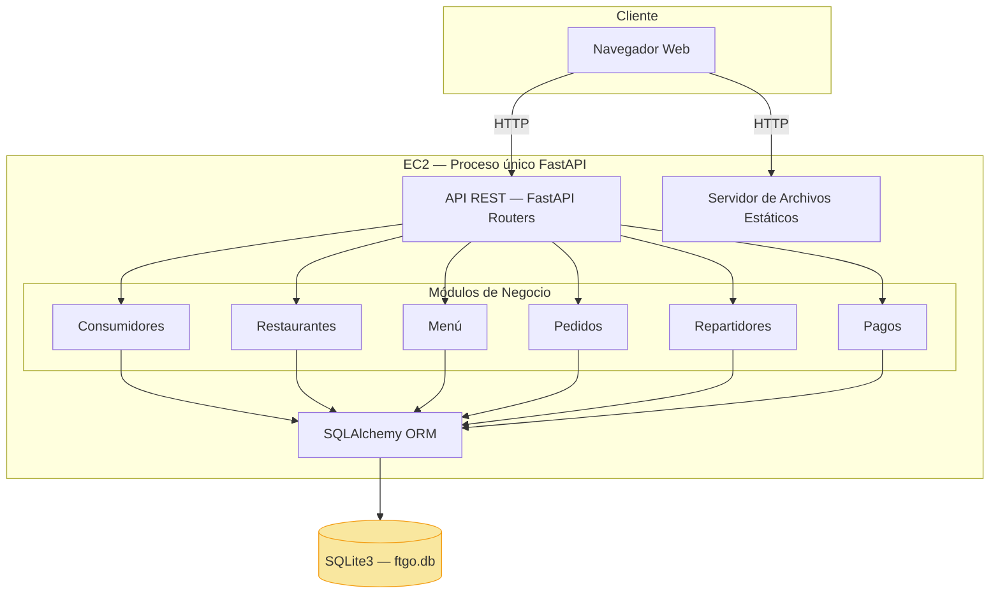

### 2.2 Stack Tecnológico del Monolito

| Componente | Tecnología | Descripción |
|------------|-----------|-------------|
| Lenguaje | Python 3.13 | Lenguaje principal |
| Framework Web | FastAPI | Framework async para APIs REST |
| Base de Datos | SQLite3 | BD relacional en archivo local |
| ORM | SQLAlchemy 2.0 | Mapeo objeto-relacional |
| Validación | Pydantic v2 | Validación de datos de entrada/salida |
| Servidor | uvicorn | Servidor ASGI para FastAPI |
| Dependencias | uv | Gestor de paquetes Python |
| Frontend | HTML/CSS/JS vanilla | Sin frameworks de frontend |

### 2.3 Modelo de Datos Relacional (SQLite3)

El monolito tiene 7 tablas interrelacionadas con foreign keys:

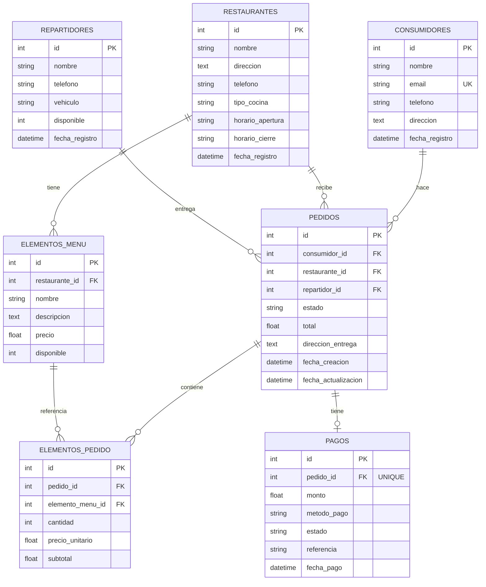

### 2.4 Características del Monolito

- **Un solo proceso**: todos los módulos se ejecutan dentro de la misma instancia de FastAPI
- **Una sola base de datos**: todas las tablas están en `ftgo.db` con foreign keys entre ellas
- **Transacciones ACID**: SQLAlchemy garantiza consistencia transaccional entre tablas
- **Acoplamiento directo**: los módulos importan modelos y la sesión de BD directamente
- **Despliegue único**: cualquier cambio requiere reiniciar toda la aplicación
- **Costo fijo**: la instancia EC2 cuesta ~$25 USD/mes esté o no recibiendo tráfico

---

## 3. Problemas del Monolito — Por Qué Migrar

Chris Richardson documenta en su libro los problemas exactos que FTGO experimentó en la vida real. Estos mismos problemas se manifiestan en nuestro monolito educativo:

### 3.1 Acoplamiento Fuerte

Todos los módulos comparten `models.py`, `database.py` y la misma sesión de base de datos. Un cambio en el modelo `Pedido` puede afectar a Pagos, Repartidores y Restaurantes porque todos acceden a las mismas tablas a través del ORM.

```python
# En el monolito, el módulo de Pedidos importa directamente
# modelos de otros dominios — acoplamiento fuerte
from app.models import Consumidor, Restaurante, ElementoMenu, Repartidor, Pedido
```

### 3.2 Base de Datos Compartida

Todas las tablas están en `ftgo.db`. No se puede escalar la base de datos de pedidos independientemente de la de restaurantes. Si la tabla de pedidos crece a millones de registros, SQLite se vuelve un cuello de botella para TODO el sistema.

### 3.3 Despliegue Monolítico

Para corregir un bug en el módulo de pagos hay que redesplegar toda la aplicación, incluyendo consumidores, menús y repartidores. Mientras Amazon hace 130,000 deploys por día, un monolito típico solo puede desplegar una vez al mes.

### 3.4 Escalamiento Uniforme

Si el módulo de pedidos necesita más recursos (por ejemplo, durante la hora de la comida), hay que escalar toda la aplicación — incluyendo módulos que no lo necesitan como el registro de consumidores.

### 3.5 Un Solo Punto de Fallo

Si el módulo de pagos tiene un memory leak o un error no manejado, se cae toda la aplicación. No hay aislamiento entre módulos.

### 3.6 Stack Tecnológico Fijo

Todo está en Python/FastAPI. No se puede usar Go para el módulo de entregas en tiempo real o Rust para procesamiento intensivo de datos.

### 3.7 Diagrama del Problema

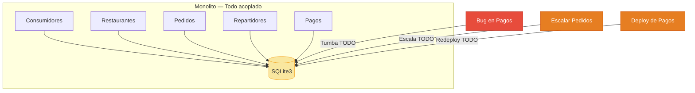

---

## 4. Estrategia de Descomposición — Domain-Driven Design

### 4.1 Identificación de Bounded Contexts

El primer paso de la refactorización es identificar los **bounded contexts** (contextos delimitados) del sistema usando Domain-Driven Design (DDD). Cada bounded context se convierte en un microservicio independiente.

Se identificaron 5 dominios de negocio:

| # | Dominio | Responsabilidad | Entidades | Tabla DynamoDB |
|---|---------|-----------------|-----------|----------------|
| 1 | **Consumidores** | Registro y gestión de clientes | Consumidor | `ftgo-consumidores` |
| 2 | **Restaurantes** | Gestión de restaurantes y menús | Restaurante, ElementoMenu | `ftgo-restaurantes` |
| 3 | **Pedidos** | Ciclo de vida completo del pedido | Pedido, ElementoPedido | `ftgo-pedidos` |
| 4 | **Entregas** | Gestión de repartidores | Repartidor | `ftgo-repartidores` |
| 5 | **Pagos** | Procesamiento de pagos | Pago | `ftgo-pagos` |

### 4.2 Principio: Database per Service

Cada microservicio es **dueño exclusivo** de sus datos. No hay base de datos compartida. Esto significa:

- Cada servicio tiene su propia tabla DynamoDB
- No existen foreign keys entre tablas de diferentes servicios
- La integridad referencial se garantiza a nivel de aplicación (validaciones HTTP)
- Se acepta **consistencia eventual** entre dominios (en vez de ACID transaccional)

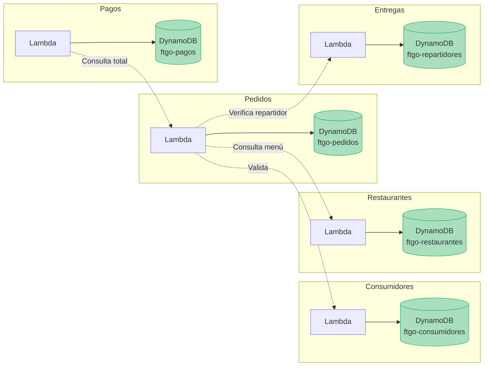

### 4.3 Mapeo: Módulos del Monolito → Microservicios

| Monolito (FastAPI) | Microservicio (Lambda) | Cambio Principal |
|---------------------|------------------------|------------------|
| `app/routers/consumidores.py` | `servicios/consumidores/src/handler.py` | FastAPI Router → Lambda handler |
| `app/routers/restaurantes.py` | `servicios/restaurantes/src/handler.py` | Incluye menú (single-table) |
| `app/routers/pedidos.py` | `servicios/pedidos/src/handler.py` | Llama a otros servicios por HTTP |
| `app/routers/repartidores.py` | `servicios/entregas/src/handler.py` | Consultado por Pedidos |
| `app/routers/pagos.py` | `servicios/pagos/src/handler.py` | Consulta total a Pedidos |
| `app/models.py` | Eliminado | DynamoDB no usa ORM |
| `app/schemas.py` | Eliminado | Validación manual en cada handler |
| `app/database.py` | Eliminado | boto3 reemplaza a SQLAlchemy |

---

## 5. Servicios AWS Serverless — Conceptos Fundamentales

### 5.1 ¿Qué es Serverless?

Serverless no significa "sin servidores" — significa que **tú no gestionas los servidores**. AWS se encarga de aprovisionar, escalar, parchear y mantener la infraestructura. Tú solo escribes código y defines la configuración.

Características clave:
- **Sin servidores que administrar**: no hay EC2 que parchear ni sistemas operativos que actualizar
- **Escalamiento automático**: de 0 a miles de instancias concurrentes sin configuración
- **Pago por uso**: solo se cobra por el tiempo de ejecución real (no por tiempo encendido)
- **Alta disponibilidad**: AWS distribuye automáticamente en múltiples zonas de disponibilidad

### 5.2 AWS Lambda — Compute Serverless

AWS Lambda es un servicio de cómputo que ejecuta código en respuesta a eventos (como una petición HTTP) sin necesidad de aprovisionar servidores.

**¿Cómo funciona?**

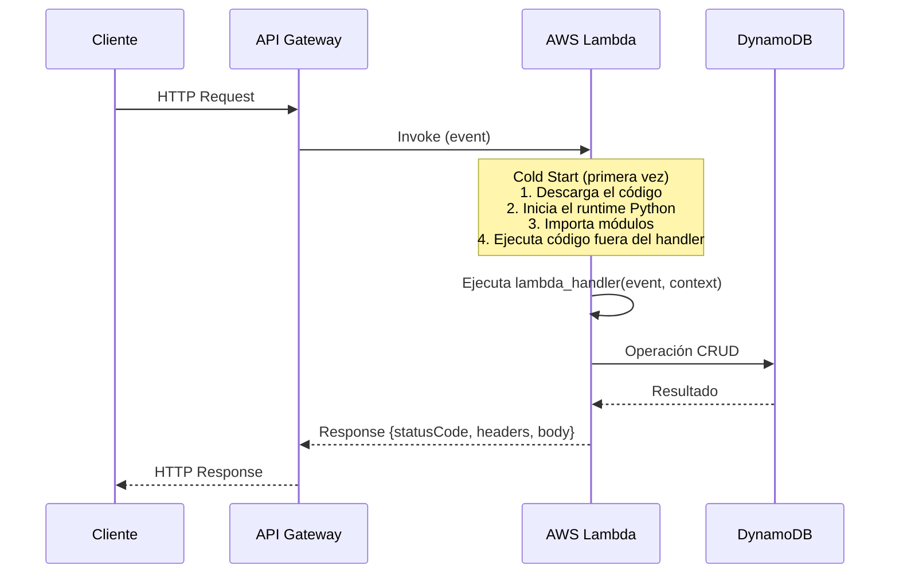

**Conceptos clave de Lambda:**

| Concepto | Descripción | Valor en FTGO |
|----------|-------------|---------------|
| **Handler** | Función que Lambda ejecuta en cada invocación | `handler.lambda_handler` |
| **Event** | Diccionario con datos de la petición HTTP | `{"httpMethod": "GET", "path": "/api/...", ...}` |
| **Context** | Metadatos del entorno de ejecución | Nombre, memoria, timeout, request ID |
| **Runtime** | Lenguaje y versión | Python 3.13 |
| **Timeout** | Tiempo máximo de ejecución | 30 segundos |
| **Memory** | Memoria asignada (también determina CPU) | 128-256 MB |
| **Cold Start** | Primera invocación (carga del runtime) | ~500ms-2s en Python |
| **Warm Start** | Invocaciones subsecuentes (runtime ya cargado) | ~5-50ms |

**Anatomía de un handler Lambda:**

```python
# El handler recibe 'event' (datos de la petición) y 'context' (metadatos)
def lambda_handler(event, context):
    metodo = event["httpMethod"]      # GET, POST, PUT, DELETE
    ruta = event["path"]              # /api/consumidores/abc-123
    cuerpo = event.get("body")        # JSON string del body

    # ... lógica de negocio ...

    # Lambda devuelve un diccionario que API Gateway convierte en HTTP Response
    return {
        "statusCode": 200,
        "headers": {"Content-Type": "application/json", ...},
        "body": '{"id": "abc-123", "nombre": "Juan"}'
    }
```

### 5.3 Amazon API Gateway — Exposición de APIs REST

API Gateway es un servicio que actúa como "puerta de entrada" para las APIs. Recibe peticiones HTTP del cliente, las valida y las enruta a la función Lambda correspondiente.

**¿Qué hace API Gateway?**

- Recibe peticiones HTTPS del navegador o cualquier cliente HTTP
- Valida la estructura de la petición (método, ruta, parámetros)
- Invoca la función Lambda con un evento que contiene toda la información de la petición
- Convierte la respuesta de Lambda en una respuesta HTTP estándar
- Maneja CORS (Cross-Origin Resource Sharing) para peticiones del navegador
- Proporciona una URL pública con certificado SSL automático

**URL generada por API Gateway:**
```
https://<api-id>.execute-api.<region>.amazonaws.com/Prod/api/consumidores/
         ^^^^^^^^                    ^^^^^^          ^^^^
         ID único                    Región AWS      Stage (ambiente)
```

**Flujo de una petición:**

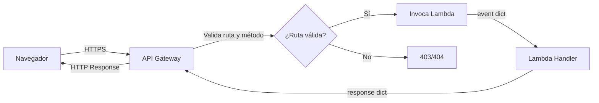

### 5.4 Amazon DynamoDB — Base de Datos NoSQL Serverless

DynamoDB es una base de datos NoSQL de clave-valor y documentos, completamente administrada por AWS. A diferencia de SQLite (relacional con SQL), DynamoDB almacena datos como documentos JSON (items) sin esquema fijo.

**Diferencias fundamentales con SQLite/SQL:**

| Aspecto | SQLite (Monolito) | DynamoDB (Microservicios) |
|---------|-------------------|---------------------------|
| Modelo | Relacional (tablas, filas, columnas) | NoSQL (items, atributos) |
| Esquema | Fijo (definido por CREATE TABLE) | Flexible (solo PK es obligatoria) |
| Consultas | SQL (SELECT, JOIN, WHERE) | API (GetItem, Query, Scan) |
| Relaciones | Foreign Keys + JOINs | No hay JOINs — relaciones lógicas |
| IDs | Auto-increment (1, 2, 3...) | UUID strings |
| Transacciones | ACID completo | ACID por item, eventual entre items |
| Escalamiento | Limitado (un archivo) | Automático (petabytes) |
| Costo | Gratis (archivo local) | Pay-per-request (~$0 con poco tráfico) |

**Conceptos clave de DynamoDB:**

| Concepto | Descripción | Ejemplo en FTGO |
|----------|-------------|-----------------|
| **Table** | Colección de items (equivalente a una tabla SQL) | `ftgo-consumidores` |
| **Item** | Un registro individual (equivalente a una fila) | `{"id": "abc", "nombre": "Juan", ...}` |
| **Attribute** | Un campo dentro de un item (equivalente a una columna) | `nombre`, `email`, `telefono` |
| **Partition Key (PK)** | Clave primaria que determina en qué partición se almacena el item | `id` (para consumidores) o `PK` (para restaurantes) |
| **Sort Key (SK)** | Clave secundaria que permite múltiples items por PK | `SK = "METADATA"` o `SK = "MENU#abc"` |
| **GSI** | Global Secondary Index — permite queries por campos no-PK | `email-index` para buscar por email |
| **Scan** | Lee TODOS los items de la tabla (costoso, O(n)) | `tabla.scan()` para listar todos |
| **Query** | Lee items por PK (eficiente, O(1) para localizar partición) | `tabla.query(PK="PED#abc")` |
| **GetItem** | Lee UN item por clave primaria (O(1)) | `tabla.get_item(Key={"id": "abc"})` |
| **PutItem** | Inserta o reemplaza un item | `tabla.put_item(Item={...})` |
| **UpdateItem** | Modifica atributos de un item existente | `tabla.update_item(Key=..., UpdateExpression=...)` |
| **DeleteItem** | Elimina un item por clave primaria | `tabla.delete_item(Key={"id": "abc"})` |

**Billing Mode: PAY_PER_REQUEST**

Todos los microservicios usan el modo de facturación `PAY_PER_REQUEST` (on-demand). Esto significa:
- No hay que provisionar capacidad de lectura/escritura por adelantado
- Se paga solo por las operaciones realizadas
- Ideal para cargas de trabajo impredecibles o con poco tráfico
- Con el Free Tier de AWS, las primeras 25 GB y 200M de requests/mes son gratis

### 5.5 AWS SAM (Serverless Application Model)

SAM es un framework de código abierto que simplifica la definición y despliegue de aplicaciones serverless en AWS. Es una extensión de CloudFormation con sintaxis simplificada para Lambda, API Gateway y DynamoDB.

**¿Qué es CloudFormation?**

CloudFormation es el servicio de Infraestructura como Código (IaC) de AWS. Permite definir TODA la infraestructura en un archivo YAML (template) y crearla/actualizarla con un solo comando. CloudFormation crea un "stack" — un conjunto de recursos AWS que se gestionan como una unidad.

**¿Qué agrega SAM sobre CloudFormation?**

SAM agrega tipos de recursos simplificados:
- `AWS::Serverless::Function` → crea Lambda + IAM Role + CloudWatch Logs (en CloudFormation puro serían 3+ recursos separados)
- Los `Events` dentro de la función crean automáticamente el API Gateway y sus rutas
- Políticas simplificadas como `DynamoDBCrudPolicy` (en CloudFormation puro serían 10+ líneas de IAM)

**Flujo de SAM:**

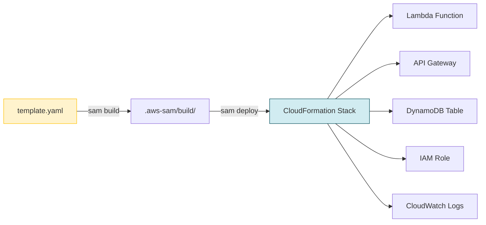

**Comandos principales de SAM:**

```bash
sam build          # Empaqueta el código y dependencias
sam deploy         # Despliega el stack en AWS (crea/actualiza recursos)
sam delete         # Elimina el stack y todos sus recursos
sam local invoke   # Ejecuta la Lambda localmente (para testing)
sam logs           # Ve los logs de CloudWatch de la Lambda
```

---

## 6. Arquitectura de Microservicios — Visión General

### 6.1 Diagrama de Arquitectura General

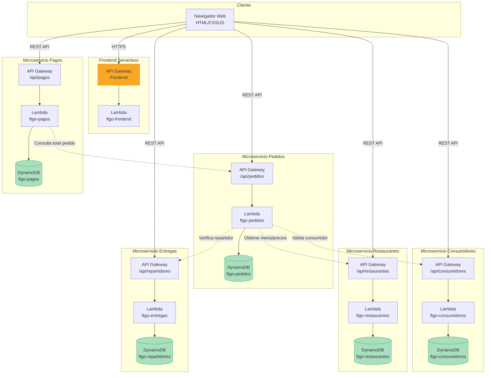

### 6.2 Infraestructura por Microservicio (Stack CloudFormation)

Cada microservicio se despliega como un stack CloudFormation independiente que contiene:

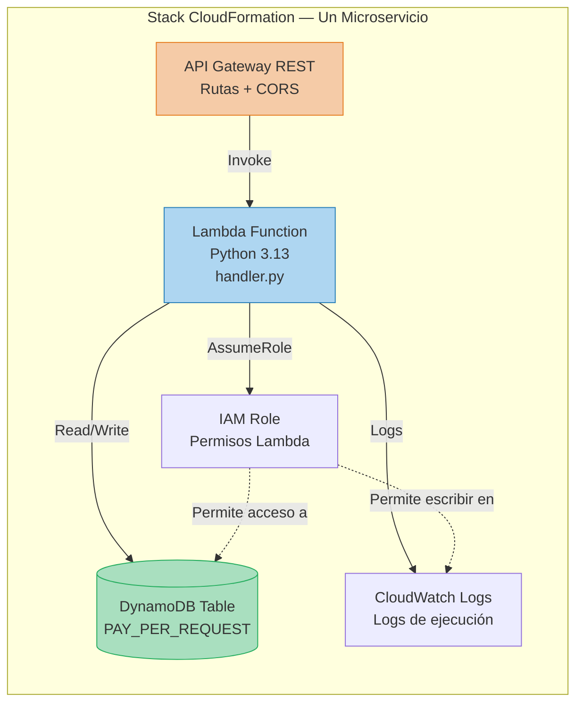

### 6.3 Estructura de Directorios del Proyecto

```
ftgo-microservicios/
├── ARQUITECTURA.md                    ← Este documento
├── DESIGN.md                          ← Documento de diseño con diagramas
├── README.md                          ← Instrucciones generales
├── DEPLOY.md                          ← Guía de despliegue paso a paso
│
├── frontend/                          ← Frontend servido por Lambda
│   ├── template.yaml                  ← SAM: Lambda + API Gateway
│   ├── src/
│   │   ├── handler.py                 ← Lambda que sirve el HTML
│   │   └── static/
│   │       └── index.html             ← HTML con CSS/JS inline
│   └── .github/workflows/deploy.yml   ← Pipeline CI/CD
│
├── servicios/
│   ├── consumidores/                  ← Microservicio Consumidores
│   │   ├── template.yaml             ← SAM: Lambda + API GW + DynamoDB
│   │   ├── pyproject.toml            ← Dependencias Python (uv)
│   │   ├── src/
│   │   │   ├── __init__.py
│   │   │   └── handler.py            ← Código de la Lambda
│   │   └── .github/workflows/deploy.yml
│   │
│   ├── restaurantes/                  ← Microservicio Restaurantes + Menú
│   ├── pedidos/                       ← Microservicio Pedidos (el más complejo)
│   ├── entregas/                      ← Microservicio Repartidores
│   └── pagos/                         ← Microservicio Pagos
│
└── scripts/
    └── migrar_sqlite_a_dynamodb.py    ← Script de migración de datos
```

---

## 7. Diseño de Datos — De SQL Relacional a DynamoDB NoSQL

### 7.1 Cambio de Paradigma

La migración de SQLite a DynamoDB implica un cambio fundamental en cómo se modelan los datos:

| Concepto | SQLite (Relacional) | DynamoDB (NoSQL) |
|----------|---------------------|-------------------|
| Identificadores | `int` auto-increment (1, 2, 3...) | `string` UUID v4 (`"550e8400-..."`) |
| Relaciones | Foreign Keys + JOINs | Referencias lógicas (IDs como strings) |
| Integridad | Garantizada por la BD (CASCADE, RESTRICT) | Garantizada por la aplicación (HTTP) |
| Esquema | Fijo (ALTER TABLE para cambiar) | Flexible (cada item puede tener atributos diferentes) |
| Consultas | SQL libre (cualquier WHERE, JOIN, GROUP BY) | Limitadas a PK/SK + GSIs predefinidos |
| Números | `int`, `float` | `Decimal` (precisión exacta) |
| Fechas | `datetime` nativo | `string` ISO 8601 (`"2026-04-27T14:30:00"`) |

### 7.2 Diagrama Entidad-Relación (DynamoDB)

```mermaid
erDiagram
    FTGO_CONSUMIDORES {
        string id PK "UUID v4"
        string nombre "Nombre completo"
        string email "GSI: email-index"
        string telefono "Teléfono de contacto"
        string direccion "Dirección de entrega"
        string fecha_registro "ISO 8601"
    }

    FTGO_RESTAURANTES {
        string PK PK "REST#uuid"
        string SK SK "METADATA o MENU#uuid"
        string tipo_entidad "restaurante o elemento_menu"
        string id "UUID público"
        string nombre "Nombre"
        number precio "Solo en elementos del menú"
        number disponible "Solo en elementos del menú"
    }

    FTGO_PEDIDOS {
        string PK PK "PED#uuid"
        string SK SK "METADATA o ELEM#uuid"
        string tipo_entidad "pedido o elemento_pedido"
        string id "UUID público"
        string consumidor_id "GSI: consumidor-index"
        string estado "Máquina de estados"
        number total "Total del pedido"
    }

    FTGO_REPARTIDORES {
        string id PK "UUID v4"
        string nombre "Nombre completo"
        string telefono "Teléfono"
        string vehiculo "Tipo de vehículo"
        number disponible "1=libre 0=ocupado"
        string fecha_registro "ISO 8601"
    }

    FTGO_PAGOS {
        string id PK "UUID v4"
        string pedido_id "GSI: pedido-index"
        number monto "Monto del pago"
        string metodo_pago "tarjeta o efectivo"
        string estado "COMPLETADO"
        string referencia "PAY-XXXXXXXXXXXX"
        string fecha_pago "ISO 8601"
    }

    FTGO_CONSUMIDORES ||--o{ FTGO_PEDIDOS : "referenciado por consumidor_id"
    FTGO_RESTAURANTES ||--o{ FTGO_PEDIDOS : "referenciado por restaurante_id"
    FTGO_REPARTIDORES ||--o{ FTGO_PEDIDOS : "referenciado por repartidor_id"
    FTGO_PEDIDOS ||--o| FTGO_PAGOS : "referenciado por pedido_id"
```

### 7.3 Diseño de Cada Tabla

#### Tabla: `ftgo-consumidores` (Diseño Simple)

Diseño de clave simple — cada consumidor es un item con `id` como partition key.

| Atributo | Tipo DynamoDB | Clave | Descripción |
|----------|---------------|-------|-------------|
| `id` | String (UUID) | **PK** (Partition Key) | Identificador único |
| `nombre` | String | — | Nombre completo |
| `email` | String | **GSI-PK** (`email-index`) | Email único (verificado por GSI) |
| `telefono` | String | — | Teléfono de contacto |
| `direccion` | String | — | Dirección de entrega |
| `fecha_registro` | String (ISO 8601) | — | Fecha de registro |

El GSI `email-index` permite verificar unicidad del email al crear un consumidor (equivalente a `UNIQUE` en SQL).

#### Tabla: `ftgo-restaurantes` (Single-Table Design)

Diseño de clave compuesta (PK + SK) — restaurantes y platillos del menú coexisten en la misma tabla.

| PK | SK | tipo_entidad | Descripción |
|----|----|-------------|-------------|
| `REST#<uuid>` | `METADATA` | `restaurante` | Datos del restaurante |
| `REST#<uuid>` | `MENU#<uuid>` | `elemento_menu` | Un platillo del menú |
| `REST#<uuid>` | `MENU#<uuid>` | `elemento_menu` | Otro platillo del menú |

**¿Por qué single-table design?**

Al compartir el mismo PK, una sola query por `PK = "REST#abc"` devuelve el restaurante Y todos sus platillos en una operación. Esto es equivalente a un JOIN en SQL pero mucho más eficiente en DynamoDB.

```python
# Una sola query obtiene restaurante + menú completo
resultado = tabla.query(
    KeyConditionExpression=Key("PK").eq(f"REST#{restaurante_id}")
)
# resultado["Items"] contiene el METADATA + todos los MENU#...
```

#### Tabla: `ftgo-pedidos` (Single-Table Design)

Mismo patrón que restaurantes — pedidos y sus elementos comparten tabla.

| PK | SK | tipo_entidad | Descripción |
|----|----|-------------|-------------|
| `PED#<uuid>` | `METADATA` | `pedido` | Datos del pedido (estado, total, fechas) |
| `PED#<uuid>` | `ELEM#<uuid>` | `elemento_pedido` | Un platillo dentro del pedido |
| `PED#<uuid>` | `ELEM#<uuid>` | `elemento_pedido` | Otro platillo del pedido |

GSI `consumidor-index` permite buscar todos los pedidos de un consumidor.

#### Tabla: `ftgo-repartidores` (Diseño Simple)

| Atributo | Tipo | Clave | Descripción |
|----------|------|-------|-------------|
| `id` | String (UUID) | **PK** | Identificador único |
| `nombre` | String | — | Nombre completo |
| `telefono` | String | — | Teléfono |
| `vehiculo` | String | — | Tipo de vehículo |
| `disponible` | Number (0/1) | — | 1=libre, 0=ocupado |
| `fecha_registro` | String | — | Fecha de registro |

#### Tabla: `ftgo-pagos` (Diseño Simple)

| Atributo | Tipo | Clave | Descripción |
|----------|------|-------|-------------|
| `id` | String (UUID) | **PK** | Identificador único |
| `pedido_id` | String | **GSI-PK** (`pedido-index`) | Referencia al pedido |
| `monto` | Number (Decimal) | — | Monto del pago |
| `metodo_pago` | String | — | "tarjeta" o "efectivo" |
| `estado` | String | — | "COMPLETADO" |
| `referencia` | String | — | Referencia única (PAY-XXXX) |
| `fecha_pago` | String | — | Fecha del pago |

El GSI `pedido-index` permite verificar que no exista ya un pago para un pedido (idempotencia).

---

## 8. Comunicación entre Microservicios

### 8.1 Patrón de Comunicación: Síncrona vía HTTP

En esta implementación se usa comunicación **síncrona** (HTTP REST) entre servicios. El servicio que llama se queda esperando la respuesta del servicio remoto.

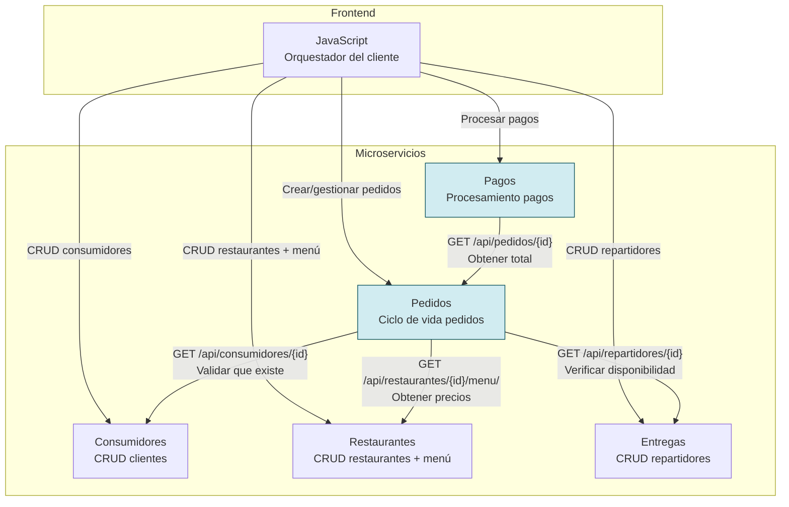

### 8.2 Detalle de las Llamadas Inter-Servicio

| Servicio Origen | Servicio Destino | Operación | Propósito |
|-----------------|------------------|-----------|-----------|
| Pedidos | Consumidores | `GET /api/consumidores/{id}` | Validar que el consumidor existe antes de crear pedido |
| Pedidos | Restaurantes | `GET /api/restaurantes/{id}/menu/` | Obtener platillos y precios para calcular total |
| Pedidos | Entregas | `GET /api/repartidores/{id}` | Verificar que el repartidor existe y está disponible |
| Pagos | Pedidos | `GET /api/pedidos/{id}` | Obtener el total del pedido para procesar el pago |

### 8.3 Implementación con urllib.request

Las llamadas entre servicios se hacen con `urllib.request` (librería estándar de Python), sin dependencias externas como `requests`. Esto mantiene el paquete Lambda pequeño y los cold starts rápidos.

```python
import urllib.request
import json

def llamar_servicio(url):
    """Hace una petición HTTP GET a otro microservicio."""
    try:
        req = urllib.request.Request(url)
        with urllib.request.urlopen(req, timeout=10) as resp:
            if resp.status == 200:
                return json.loads(resp.read().decode())
    except Exception as error:
        print(f"Error llamando a {url}: {error}")
    return None
```

Las URLs de los otros servicios se pasan como **variables de entorno** configuradas en el `template.yaml`:

```yaml
Environment:
  Variables:
    API_CONSUMIDORES_URL: "https://abc123.execute-api.us-east-1.amazonaws.com/Prod"
    API_RESTAURANTES_URL: "https://def456.execute-api.us-east-1.amazonaws.com/Prod"
    API_ENTREGAS_URL: "https://ghi789.execute-api.us-east-1.amazonaws.com/Prod"
```

### 8.4 Consistencia Eventual

Al separar las bases de datos, se pierde la transaccionalidad ACID entre dominios:

- **En el monolito**: crear un pedido, sus elementos y actualizar el total es UNA transacción SQL. Si algo falla, todo se revierte automáticamente (ROLLBACK).
- **En microservicios**: si la validación del consumidor falla después de haber escrito parcialmente en DynamoDB, no hay rollback automático.

**Estrategia adoptada (Saga simplificada):**
- Si falla la validación del consumidor → se retorna error inmediato (no se escribe nada)
- Si falla la validación del restaurante → se retorna error inmediato
- Solo se escribe en DynamoDB después de que TODAS las validaciones pasen
- Si falla la escritura en DynamoDB → se retorna error 500

Para un sistema de producción más robusto se usaría el patrón Saga completo con compensaciones.

---

## 9. Infraestructura como Código — AWS SAM y CloudFormation

### 9.1 Anatomía de un template.yaml (Ejemplo: Consumidores)

El `template.yaml` es el archivo que define TODA la infraestructura de un microservicio. Un solo `sam deploy` crea todos los recursos.

```yaml
AWSTemplateFormatVersion: '2010-09-09'
Transform: AWS::Serverless-2016-10-31    # ← Activa la transformación SAM
Description: FTGO Microservicio Consumidores

# ─── Variables globales para todas las funciones Lambda ───
Globals:
  Function:
    Timeout: 30              # Máximo 30 segundos por invocación
    Runtime: python3.13      # Runtime de Python
    MemorySize: 128          # 128 MB de memoria (mínimo)
    Environment:
      Variables:
        TABLA_CONSUMIDORES: !Ref TablaConsumidores  # ← Referencia al recurso

# ─── Recursos AWS que se crean ───
Resources:

  # La función Lambda
  ConsumidoresFunction:
    Type: AWS::Serverless::Function
    Properties:
      FunctionName: ftgo-consumidores
      Handler: handler.lambda_handler     # archivo.funcion
      CodeUri: src/                       # Directorio con el código
      Policies:
        - DynamoDBCrudPolicy:             # Permiso para CRUD en DynamoDB
            TableName: !Ref TablaConsumidores
      Events:                             # Cada evento = una ruta del API Gateway
        ListarConsumidores:
          Type: Api
          Properties:
            Path: /api/consumidores/
            Method: GET
        CrearConsumidor:
          Type: Api
          Properties:
            Path: /api/consumidores/
            Method: POST
        # ... más rutas ...

  # La tabla DynamoDB
  TablaConsumidores:
    Type: AWS::DynamoDB::Table
    Properties:
      TableName: ftgo-consumidores
      BillingMode: PAY_PER_REQUEST        # Pago por uso (sin provisionar)
      AttributeDefinitions:
        - AttributeName: id
          AttributeType: S                # S = String
        - AttributeName: email
          AttributeType: S
      KeySchema:
        - AttributeName: id
          KeyType: HASH                   # Partition Key
      GlobalSecondaryIndexes:
        - IndexName: email-index
          KeySchema:
            - AttributeName: email
              KeyType: HASH
          Projection:
            ProjectionType: ALL           # Proyectar todos los atributos

# ─── Outputs (valores útiles post-despliegue) ───
Outputs:
  ApiUrl:
    Value: !Sub "https://${ServerlessRestApi}.execute-api.${AWS::Region}.amazonaws.com/Prod"
```

### 9.2 Lo que SAM crea automáticamente

Cuando defines una `AWS::Serverless::Function` con eventos `Api`, SAM crea automáticamente:

| Recurso | Creado por SAM | Equivalente manual |
|---------|----------------|-------------------|
| Lambda Function | ✅ Automático | `AWS::Lambda::Function` |
| IAM Execution Role | ✅ Automático | `AWS::IAM::Role` + `AWS::IAM::Policy` |
| API Gateway REST API | ✅ Automático | `AWS::ApiGateway::RestApi` + `Method` + `Resource` |
| API Gateway Stage (Prod) | ✅ Automático | `AWS::ApiGateway::Stage` |
| Lambda Permission | ✅ Automático | `AWS::Lambda::Permission` |
| CloudWatch Log Group | ✅ Automático | `AWS::Logs::LogGroup` |

Sin SAM, definir todo esto manualmente en CloudFormation requeriría ~100+ líneas de YAML por cada ruta.

### 9.3 Parámetros para Comunicación Inter-Servicio

El microservicio de Pedidos necesita las URLs de otros servicios. Estas se pasan como parámetros del stack:

```yaml
Parameters:
  ApiConsumidoresUrl:
    Type: String
    Description: URL del API Gateway del microservicio de consumidores
    Default: ""
  ApiRestaurantesUrl:
    Type: String
    Description: URL del API Gateway del microservicio de restaurantes
    Default: ""
  ApiEntregasUrl:
    Type: String
    Description: URL del API Gateway del microservicio de entregas
    Default: ""
```

Al desplegar:
```bash
sam deploy --parameter-overrides \
  ApiConsumidoresUrl=https://abc.execute-api.us-east-1.amazonaws.com/Prod \
  ApiRestaurantesUrl=https://def.execute-api.us-east-1.amazonaws.com/Prod \
  ApiEntregasUrl=https://ghi.execute-api.us-east-1.amazonaws.com/Prod
```

### 9.4 Resumen de Stacks CloudFormation

| Stack | Recursos Principales | Parámetros |
|-------|---------------------|------------|
| `ftgo-consumidores` | Lambda + API GW + DynamoDB + GSI(email) | Ninguno |
| `ftgo-restaurantes` | Lambda + API GW + DynamoDB(PK+SK) | Ninguno |
| `ftgo-pedidos` | Lambda + API GW + DynamoDB(PK+SK) + GSI(consumidor) | URLs de consumidores, restaurantes, entregas |
| `ftgo-entregas` | Lambda + API GW + DynamoDB | Ninguno |
| `ftgo-pagos` | Lambda + API GW + DynamoDB + GSI(pedido) | URL de pedidos |
| `ftgo-frontend` | Lambda + API GW | Ninguno (URLs hardcodeadas en HTML) |

---

## 10. Detalle por Microservicio

### 10.1 Microservicio de Consumidores

**Responsabilidad:** Gestionar el registro y administración de clientes.

| Aspecto | Detalle |
|---------|---------|
| Lambda | `ftgo-consumidores` (128 MB, 30s timeout) |
| Tabla | `ftgo-consumidores` (PK: `id`, GSI: `email-index`) |
| Endpoints | POST, GET, GET/{id}, PUT/{id}, DELETE/{id} |
| Dependencias | Ninguna (servicio independiente) |
| Consultado por | Pedidos (para validar que el consumidor existe) |

**Operaciones:**
- `crear_consumidor()` — Valida unicidad de email vía GSI, genera UUID, guarda en DynamoDB
- `listar_consumidores()` — Scan completo de la tabla
- `obtener_consumidor()` — GetItem por PK (O(1))
- `actualizar_consumidor()` — UpdateItem con merge parcial
- `eliminar_consumidor()` — DeleteItem por PK

---

### 10.2 Microservicio de Restaurantes

**Responsabilidad:** Gestionar restaurantes y sus menús (platillos).

| Aspecto | Detalle |
|---------|---------|
| Lambda | `ftgo-restaurantes` (128 MB, 30s timeout) |
| Tabla | `ftgo-restaurantes` (PK: `PK`, SK: `SK` — single-table design) |
| Endpoints | CRUD restaurantes + CRUD menú (9 rutas) |
| Dependencias | Ninguna |
| Consultado por | Pedidos (para obtener menú y precios) |

**Single-Table Design:**
```
PK = "REST#<uuid>"  +  SK = "METADATA"      → Restaurante
PK = "REST#<uuid>"  +  SK = "MENU#<uuid>"   → Platillo del menú
```

**Operaciones destacadas:**
- `obtener_menu()` — Query con `begins_with("MENU#")` — obtiene solo platillos
- `eliminar_restaurante()` — Query por PK + delete de cada item (restaurante + menú)
- `actualizar_elemento_menu()` — Requiere scan para encontrar PK del platillo por su ID

---

### 10.3 Microservicio de Pedidos (el más complejo)

**Responsabilidad:** Gestionar todo el ciclo de vida de un pedido.

| Aspecto | Detalle |
|---------|---------|
| Lambda | `ftgo-pedidos` (256 MB, 30s timeout) |
| Tabla | `ftgo-pedidos` (PK: `PK`, SK: `SK`, GSI: `consumidor-index`) |
| Endpoints | POST, GET, GET/{id}, PUT/{id}/estado, PUT/{id}/repartidor, DELETE/{id} |
| Dependencias | Consumidores, Restaurantes, Entregas (vía HTTP) |
| Consultado por | Pagos (para obtener el total) |

**Comunicación inter-servicio:**
- Al crear pedido → llama a Consumidores + Restaurantes
- Al asignar repartidor → llama a Entregas

**Máquina de estados:**
```
CREADO → ACEPTADO → PREPARANDO → LISTO → EN_CAMINO → ENTREGADO
   ↓         ↓          ↓
CANCELADO CANCELADO  CANCELADO
```

**Single-Table Design:**
```
PK = "PED#<uuid>"  +  SK = "METADATA"      → Pedido (estado, total, fechas)
PK = "PED#<uuid>"  +  SK = "ELEM#<uuid>"   → Elemento del pedido (platillo, cantidad, precio)
```

---

### 10.4 Microservicio de Entregas (Repartidores)

**Responsabilidad:** Gestionar repartidores y su disponibilidad.

| Aspecto | Detalle |
|---------|---------|
| Lambda | `ftgo-entregas` (128 MB, 30s timeout) |
| Tabla | `ftgo-repartidores` (PK: `id`) |
| Endpoints | POST, GET, GET/{id}, PUT/{id}, DELETE/{id} |
| Dependencias | Ninguna |
| Consultado por | Pedidos (para verificar disponibilidad) |

**Campo `disponible`:**
- `1` = El repartidor está libre y puede recibir pedidos
- `0` = El repartidor está ocupado entregando un pedido

DynamoDB almacena números como `Decimal`, por lo que se convierte a `int` antes de serializar a JSON.

---

### 10.5 Microservicio de Pagos

**Responsabilidad:** Procesar y registrar pagos de pedidos.

| Aspecto | Detalle |
|---------|---------|
| Lambda | `ftgo-pagos` (128 MB, 30s timeout) |
| Tabla | `ftgo-pagos` (PK: `id`, GSI: `pedido-index`) |
| Endpoints | POST, GET, GET/{id} |
| Dependencias | Pedidos (para obtener el total) |
| Consultado por | Nadie |

**Flujo de procesamiento:**
1. Recibe `{pedido_id, metodo_pago}`
2. Consulta al microservicio de Pedidos para obtener el total
3. Verifica idempotencia (no duplicar pagos) vía GSI `pedido-index`
4. Simula procesamiento (en producción sería Stripe/PayPal)
5. Genera referencia única `PAY-XXXXXXXXXXXX`
6. Guarda registro en DynamoDB

---

### 10.6 Frontend

**Responsabilidad:** Servir la interfaz web como HTML con CSS/JS inline.

| Aspecto | Detalle |
|---------|---------|
| Lambda | `ftgo-frontend` (128 MB, 10s timeout) |
| Tabla | Ninguna |
| Endpoints | GET / (raíz) + GET /{proxy+} (cualquier ruta) |
| Dependencias | Ninguna (las URLs de APIs están en el JavaScript) |

El frontend es un solo archivo HTML que contiene todo el CSS y JavaScript embebido. Esto evita problemas de routing con API Gateway para archivos estáticos.

---

## 11. Flujos de Negocio — Diagramas de Secuencia

### 11.1 Crear un Pedido (Flujo más complejo — orquestación entre 3 servicios)

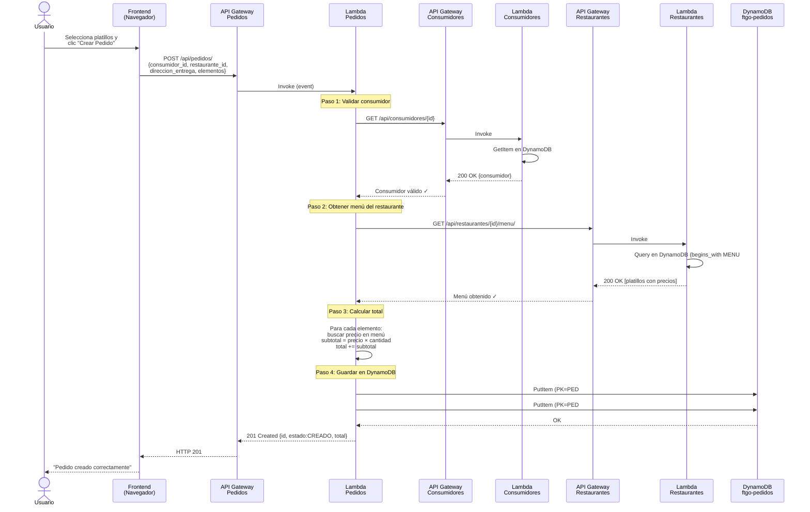

### 11.2 Ciclo de Vida del Pedido (Transiciones de Estado)

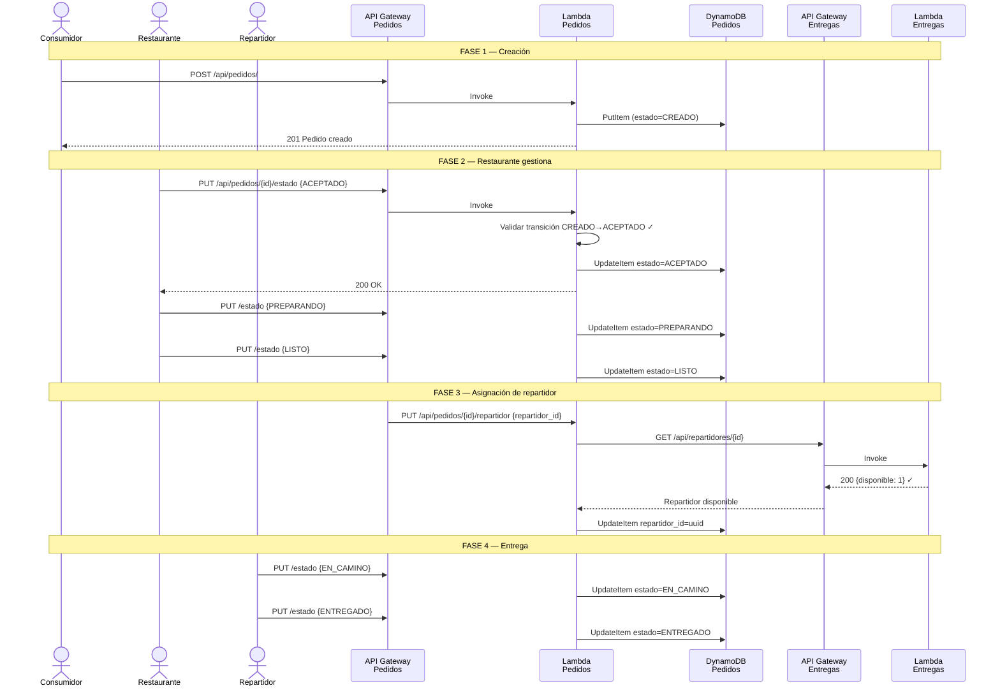

### 11.3 Procesar un Pago

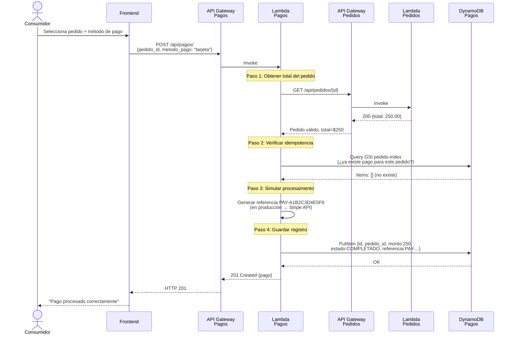

### 11.4 Máquina de Estados del Pedido

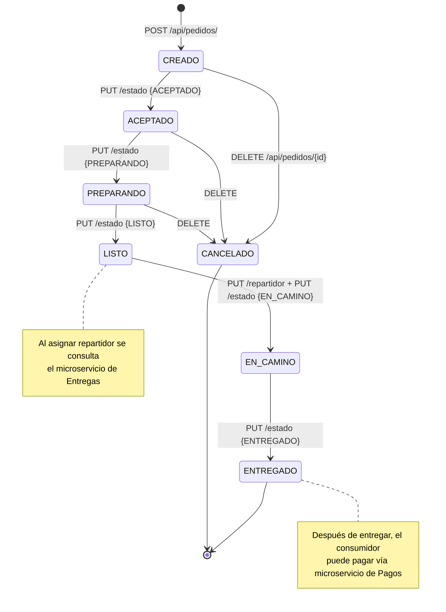

---

## 12. CI/CD — Despliegue Automatizado con GitHub Actions

### 12.1 Pipeline por Microservicio

Cada microservicio tiene su propio pipeline de GitHub Actions que se activa **solo cuando cambian archivos en su directorio**. Esto permite despliegues independientes.

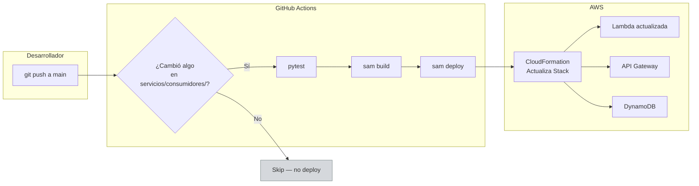

### 12.2 Estructura del Workflow (deploy.yml)

```yaml
name: Deploy Consumidores
on:
  push:
    branches: [main]
    paths: ['servicios/consumidores/**']  # ← Solo se activa si cambia este directorio

jobs:
  deploy:
    runs-on: ubuntu-latest
    steps:
      - uses: actions/checkout@v4

      - uses: aws-actions/setup-sam@v2

      - uses: aws-actions/configure-aws-credentials@v4
        with:
          aws-access-key-id: ${{ secrets.AWS_ACCESS_KEY_ID }}
          aws-secret-access-key: ${{ secrets.AWS_SECRET_ACCESS_KEY }}
          aws-region: us-east-1

      - run: sam build
        working-directory: servicios/consumidores

      - run: sam deploy --no-confirm-changeset --no-fail-on-empty-changeset
        working-directory: servicios/consumidores
```

### 12.3 Orden de Despliegue (Primera Vez)

La primera vez se despliegan en orden de dependencias:

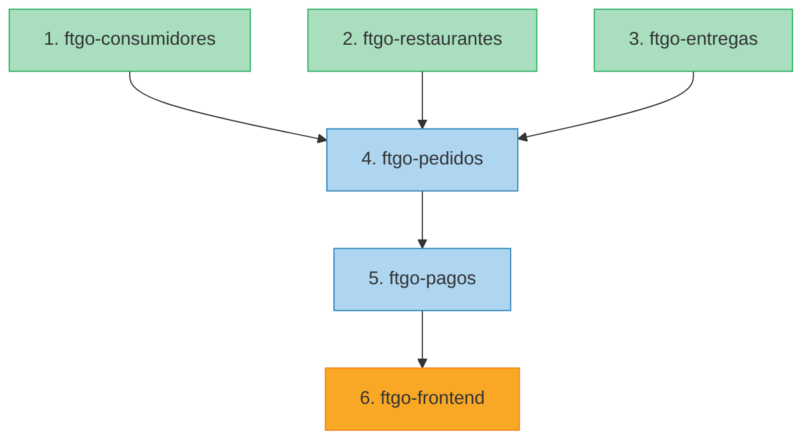

Después del primer despliegue, cada servicio se puede actualizar independientemente sin afectar a los demás.

---

## 13. Migración de Datos — SQLite a DynamoDB

### 13.1 Dos Scripts de Migración

El proyecto incluye dos scripts de migración con propósitos diferentes:

| Script | Propósito | Uso |
|--------|-----------|-----|
| `migrar_sqlite_a_dynamodb.py` | Migra TODO de una vez (un solo operador) | Desarrollo, testing |
| `migrar_por_dominio.py` | Migra UN dominio a la vez (trabajo en equipo) | Meetup, células paralelas |

El script `migrar_por_dominio.py` está diseñado para el meetup donde cada célula de trabajo migra su propio dominio de forma independiente y comparte archivos JSON de mapeo con las células que dependen de ella.

### 13.2 El Problema: IDs Incompatibles

El desafío central de la migración es que los IDs cambian de formato:

```
SQLite (monolito):    id = 1, 2, 3, 4, 5 ...        (int auto-increment)
DynamoDB (microserv): id = "a1b2c3d4-e5f6-..."       (UUID v4 string)
```

Cuando un pedido en SQLite tiene `consumidor_id = 3`, necesitamos saber cuál es el UUID que se le asignó al consumidor 3 en DynamoDB. Sin esa información, las referencias se pierden.

**Solución: Archivos JSON de mapeo.**

### 13.3 Archivos JSON de Mapeo

Cada dominio sin dependencias genera un archivo JSON que mapea IDs viejos (int) a UUIDs nuevos:

**`mapeo_consumidores.json`** (generado por la Célula 2):
```json
{
  "1": "a1b2c3d4-e5f6-7890-abcd-ef1234567890",
  "2": "b2c3d4e5-f6a7-8901-bcde-f12345678901",
  "3": "c3d4e5f6-a7b8-9012-cdef-123456789012"
}
```

**`mapeo_restaurantes.json`** (generado por la Célula 3):
```json
{
  "1": "d4e5f6a7-b8c9-0123-defa-234567890123",
  "2": "e5f6a7b8-c9d0-1234-efab-345678901234"
}
```

**`mapeo_menu.json`** (generado por la Célula 3):
```json
{
  "1": "f6a7b8c9-d0e1-2345-fabc-456789012345",
  "2": "a7b8c9d0-e1f2-3456-abcd-567890123456",
  "3": "b8c9d0e1-f2a3-4567-bcde-678901234567"
}
```

**`mapeo_repartidores.json`** (generado por la Célula 4):
```json
{
  "1": "c9d0e1f2-a3b4-5678-cdef-789012345678",
  "2": "d0e1f2a3-b4c5-6789-defa-890123456789"
}
```

**`mapeo_pedidos.json`** (generado por la Célula 5):
```json
{
  "1": "e1f2a3b4-c5d6-7890-efab-901234567890",
  "2": "f2a3b4c5-d6e7-8901-fabc-012345678901"
}
```

### 13.4 Flujo de Mapeos entre Células

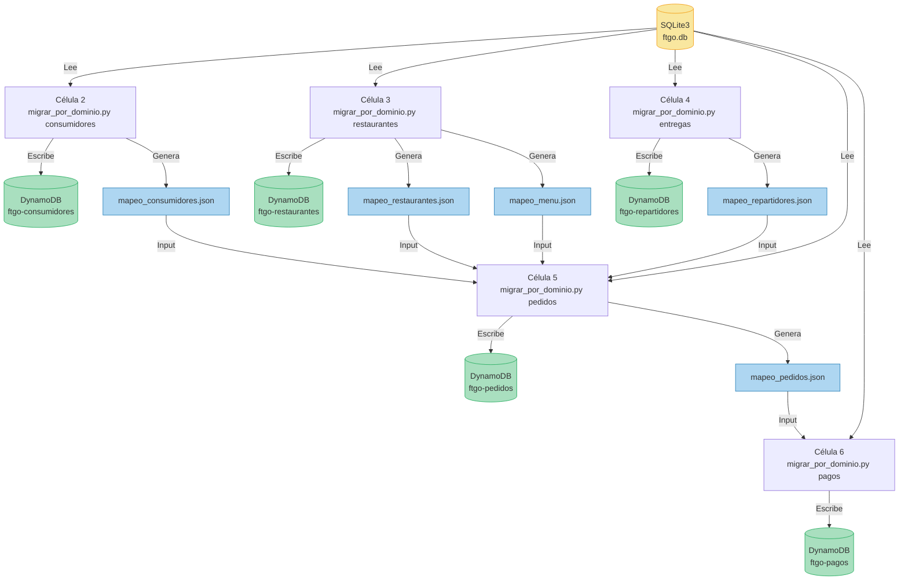

### 13.5 Uso del Script `migrar_por_dominio.py`

```bash
cd ftgo-microservicios/scripts
pip install boto3

# ─── Fase 1: Dominios sin dependencias (en paralelo) ───

# Célula 2 ejecuta:
python migrar_por_dominio.py consumidores
# → Genera: mapeo_consumidores.json

# Célula 3 ejecuta:
python migrar_por_dominio.py restaurantes
# → Genera: mapeo_restaurantes.json + mapeo_menu.json

# Célula 4 ejecuta:
python migrar_por_dominio.py entregas
# → Genera: mapeo_repartidores.json

# ─── Fase 2: Pedidos (necesita mapeos de fase 1) ───

# Célula 5 ejecuta (después de recibir los 4 archivos JSON):
python migrar_por_dominio.py pedidos \
  --mapeo-consumidores mapeo_consumidores.json \
  --mapeo-restaurantes mapeo_restaurantes.json \
  --mapeo-menu mapeo_menu.json \
  --mapeo-repartidores mapeo_repartidores.json
# → Genera: mapeo_pedidos.json

# ─── Fase 3: Pagos (necesita mapeo de pedidos) ───

# Célula 6 ejecuta (después de recibir mapeo_pedidos.json):
python migrar_por_dominio.py pagos \
  --mapeo-pedidos mapeo_pedidos.json
```

### 13.6 Desafíos de la Migración y Soluciones

| Desafío | Problema | Solución |
|---------|----------|----------|
| IDs incompatibles | SQLite usa `int`, DynamoDB usa `string` | Generar UUID v4 y guardar mapeo en JSON |
| Foreign keys desaparecen | DynamoDB no tiene FK ni JOINs | Traducir FK usando archivos de mapeo JSON |
| `float` → `Decimal` | DynamoDB no acepta `float` | `Decimal(str(valor))` para precisión exacta |
| `datetime` → `string` | DynamoDB no tiene tipo datetime | Formato ISO 8601 como string |
| Single-table design | Restaurantes + menú en misma tabla | Construir PK/SK compuestos (`REST#uuid`, `MENU#uuid`) |
| Orden de migración | Pedidos depende de consumidores, restaurantes, repartidores | Migrar en fases respetando dependencias |
| Trabajo en equipo | Cada célula migra su dominio por separado | Archivos JSON compartidos entre células |

### 13.7 Ejemplo Completo de Transformación

**Antes (SQLite — relacional con int IDs y foreign keys):**
```sql
-- Consumidor con id=3
INSERT INTO consumidores (id, nombre, email, telefono, direccion)
VALUES (3, 'María López', 'maria@mail.com', '555-1234', 'Av. Reforma 100');

-- Restaurante con id=2
INSERT INTO restaurantes (id, nombre, tipo_cocina)
VALUES (2, 'Tacos El Paisa', 'Mexicana');

-- Platillo con id=5, referencia a restaurante 2
INSERT INTO elementos_menu (id, restaurante_id, nombre, precio)
VALUES (5, 2, 'Tacos al pastor', 85.50);

-- Pedido con id=1, referencias a consumidor 3 y restaurante 2
INSERT INTO pedidos (id, consumidor_id, restaurante_id, estado, total)
VALUES (1, 3, 2, 'ENTREGADO', 171.00);

-- Elemento del pedido, referencia a pedido 1 y platillo 5
INSERT INTO elementos_pedido (id, pedido_id, elemento_menu_id, cantidad, precio_unitario, subtotal)
VALUES (1, 1, 5, 2, 85.50, 171.00);
```

**Después (DynamoDB — NoSQL con UUIDs y referencias lógicas):**

Tabla `ftgo-consumidores`:
```json
{
  "id": "c3d4e5f6-a7b8-9012-cdef-123456789012",
  "nombre": "María López",
  "email": "maria@mail.com",
  "telefono": "555-1234",
  "direccion": "Av. Reforma 100",
  "fecha_registro": "2026-04-27T10:00:00"
}
```

Tabla `ftgo-restaurantes` (item del restaurante):
```json
{
  "PK": "REST#e5f6a7b8-c9d0-1234-efab-345678901234",
  "SK": "METADATA",
  "tipo_entidad": "restaurante",
  "id": "e5f6a7b8-c9d0-1234-efab-345678901234",
  "nombre": "Tacos El Paisa",
  "tipo_cocina": "Mexicana"
}
```

Tabla `ftgo-restaurantes` (item del platillo — misma tabla, diferente SK):
```json
{
  "PK": "REST#e5f6a7b8-c9d0-1234-efab-345678901234",
  "SK": "MENU#f6a7b8c9-d0e1-2345-fabc-456789012345",
  "tipo_entidad": "elemento_menu",
  "id": "f6a7b8c9-d0e1-2345-fabc-456789012345",
  "restaurante_id": "e5f6a7b8-c9d0-1234-efab-345678901234",
  "nombre": "Tacos al pastor",
  "precio": 85.50
}
```

Tabla `ftgo-pedidos` (item del pedido):
```json
{
  "PK": "PED#e1f2a3b4-c5d6-7890-efab-901234567890",
  "SK": "METADATA",
  "tipo_entidad": "pedido",
  "id": "e1f2a3b4-c5d6-7890-efab-901234567890",
  "consumidor_id": "c3d4e5f6-a7b8-9012-cdef-123456789012",
  "restaurante_id": "e5f6a7b8-c9d0-1234-efab-345678901234",
  "estado": "ENTREGADO",
  "total": 171.00
}
```

Tabla `ftgo-pedidos` (item del elemento — misma tabla, diferente SK):
```json
{
  "PK": "PED#e1f2a3b4-c5d6-7890-efab-901234567890",
  "SK": "ELEM#a1b2c3d4-e5f6-7890-abcd-ef1234567890",
  "tipo_entidad": "elemento_pedido",
  "id": "a1b2c3d4-e5f6-7890-abcd-ef1234567890",
  "pedido_id": "e1f2a3b4-c5d6-7890-efab-901234567890",
  "elemento_menu_id": "f6a7b8c9-d0e1-2345-fabc-456789012345",
  "cantidad": 2,
  "precio_unitario": 85.50,
  "subtotal": 171.00
}
```

**Archivos de mapeo generados (los JSON que se comparten entre células):**

`mapeo_consumidores.json` — permite traducir `consumidor_id=3` → UUID:
```json
{
  "3": "c3d4e5f6-a7b8-9012-cdef-123456789012"
}
```

`mapeo_restaurantes.json` — permite traducir `restaurante_id=2` → UUID:
```json
{
  "2": "e5f6a7b8-c9d0-1234-efab-345678901234"
}
```

`mapeo_menu.json` — permite traducir `elemento_menu_id=5` → UUID:
```json
{
  "5": "f6a7b8c9-d0e1-2345-fabc-456789012345"
}
```

---

## 14. Comparación Final — Monolito vs. Microservicios

### 14.1 Diagrama Comparativo

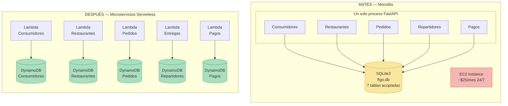

### 14.2 Tabla Comparativa Detallada

| Aspecto | Monolito | Microservicios Serverless |
|---------|----------|---------------------------|
| **Compute** | EC2 t3.micro + uvicorn (siempre encendida) | AWS Lambda (se ejecuta solo cuando hay peticiones) |
| **Framework** | FastAPI (routers, middleware, Pydantic) | Lambda handlers nativos (sin framework) |
| **Base de datos** | SQLite3 — un archivo, 7 tablas con FK | DynamoDB — 5 tablas independientes, sin FK |
| **ORM** | SQLAlchemy 2.0 (modelos, sesiones, queries) | boto3 directo (put_item, get_item, query) |
| **Validación** | Pydantic v2 (schemas tipados) | Validación manual en cada handler |
| **API** | FastAPI routers (un proceso, un puerto) | API Gateway REST (uno por dominio, HTTPS) |
| **Frontend** | Servido por FastAPI (StaticFiles) | Lambda + API Gateway (HTML inline) |
| **Despliegue** | scp + systemd (manual, todo o nada) | SAM + GitHub Actions (automatizado, por servicio) |
| **Escalamiento** | Vertical (instancia más grande) | Automático (Lambda escala de 0 a miles) |
| **Costo en reposo** | ~$25 USD/mes (EC2 24/7 + NLB) | ~$0 (pay-per-request, Free Tier) |
| **Costo bajo carga** | Fijo (misma instancia) | Proporcional al tráfico |
| **Aislamiento de fallos** | Ninguno (un bug tumba todo) | Total (cada servicio es independiente) |
| **Velocidad de deploy** | ~5 min (todo el monolito) | ~1 min (solo el servicio que cambió) |
| **IaC** | No tiene (manual) | CloudFormation/SAM (declarativo, versionado) |
| **CI/CD** | No tiene | GitHub Actions (un pipeline por servicio) |
| **Logs** | stdout local | CloudWatch Logs (centralizado, persistente) |
| **IDs** | int auto-increment (1, 2, 3...) | UUID v4 strings |
| **Transacciones** | ACID completo (SQLAlchemy commit/rollback) | Eventual (validación previa, sin rollback cross-service) |
| **Dependencias Python** | fastapi, uvicorn, sqlalchemy, pydantic | boto3 (incluido en Lambda runtime) |

### 14.3 Beneficios Obtenidos

1. **Despliegue independiente** — Se puede actualizar pagos sin tocar consumidores
2. **Escalamiento granular** — Si pedidos tiene mucho tráfico, solo esa Lambda escala
3. **Aislamiento de fallos** — Si pagos falla, los demás servicios siguen funcionando
4. **Costo optimizado** — Sin tráfico = $0 (vs. $25/mes del EC2 encendido 24/7)
5. **Equipos autónomos** — Cada equipo puede trabajar en su servicio sin coordinarse
6. **Libertad tecnológica** — Cada servicio podría usar un lenguaje diferente
7. **Infraestructura reproducible** — `sam deploy` recrea todo desde cero en minutos

---

## 15. Trade-offs y Complejidad Añadida

La arquitectura de microservicios no es gratis — introduce complejidad que no existía en el monolito:

| Trade-off | Descripción | Mitigación |
|-----------|-------------|------------|
| **Complejidad operacional** | 6 stacks CloudFormation que monitorear | CloudWatch Dashboards, alarmas |
| **Consistencia eventual** | No hay transacciones ACID entre servicios | Validación previa, patrón Saga simplificado |
| **Latencia de red** | Llamadas HTTP entre Lambdas (~50-200ms extra) | Minimizar llamadas, cachear cuando sea posible |
| **Debugging distribuido** | Rastrear un error que cruza servicios es difícil | AWS X-Ray para tracing distribuido |
| **Cold starts** | Primera invocación de Lambda tarda ~1-2s | Provisioned Concurrency (costo extra) |
| **Duplicación de código** | Cada handler tiene su propia lógica CORS/respuesta | Aceptable para independencia de servicios |
| **Testing integración** | Probar flujos que cruzan servicios es complejo | Mocks de servicios externos, tests E2E |
| **Configuración de URLs** | Las URLs de otros servicios se pasan como parámetros | Variables de entorno en template.yaml |

---

## 16. Evolución Futura

El diseño actual está preparado para evolucionar hacia una arquitectura más robusta:

### 16.1 Comunicación Asíncrona (Amazon EventBridge)

Reemplazar llamadas HTTP síncronas con eventos asíncronos:
```
Pedidos publica evento "PedidoCreado" → EventBridge → Pagos reacciona
```
Esto desacopla completamente los servicios (si Pagos está caído, el evento se encola).

### 16.2 Observabilidad (AWS X-Ray + CloudWatch)

- **X-Ray**: tracing distribuido para seguir una petición a través de múltiples servicios
- **CloudWatch Dashboards**: métricas de latencia, errores, invocaciones por servicio
- **CloudWatch Alarms**: alertas automáticas cuando hay errores o latencia alta

### 16.3 Autenticación (Amazon Cognito)

Agregar autenticación de usuarios con Cognito:
- Registro/login de consumidores
- JWT tokens para autorizar peticiones
- API Gateway Authorizer para validar tokens automáticamente

### 16.4 Multi-Cuenta AWS

Cada dominio puede vivir en su propia cuenta AWS:
- Aislamiento total de recursos y facturación
- Límites de servicio independientes
- Permisos cross-account con IAM Roles

### 16.5 Dominio Personalizado (Route 53 + ACM)

Reemplazar las URLs de API Gateway por dominios amigables:
```
https://api.ftgo.com/consumidores/
https://api.ftgo.com/pedidos/
```

---

## Glosario de Términos

| Término | Definición |
|---------|-----------|
| **API Gateway** | Servicio AWS que actúa como puerta de entrada para APIs REST |
| **boto3** | SDK oficial de AWS para Python |
| **Bounded Context** | Límite lógico de un dominio de negocio (DDD) |
| **CloudFormation** | Servicio de IaC de AWS — define infraestructura en YAML |
| **Cold Start** | Tiempo de inicialización de una Lambda en su primera invocación |
| **CORS** | Mecanismo del navegador que controla peticiones entre dominios |
| **DynamoDB** | Base de datos NoSQL serverless de AWS |
| **GSI** | Global Secondary Index — índice adicional en DynamoDB |
| **Handler** | Función que Lambda ejecuta en cada invocación |
| **IaC** | Infrastructure as Code — definir infraestructura en archivos de código |
| **Lambda** | Servicio de compute serverless de AWS |
| **Partition Key (PK)** | Clave primaria en DynamoDB que determina la partición |
| **SAM** | Serverless Application Model — framework para apps serverless |
| **Saga** | Patrón para mantener consistencia entre microservicios |
| **Single-Table Design** | Patrón DynamoDB donde múltiples entidades comparten una tabla |
| **Sort Key (SK)** | Clave secundaria en DynamoDB para ordenar items dentro de una partición |
| **Stack** | Conjunto de recursos AWS gestionados como una unidad por CloudFormation |
| **UUID** | Universally Unique Identifier — identificador aleatorio de 128 bits |
| **Warm Start** | Invocación de Lambda cuando el runtime ya está cargado (rápida) |

---

*Documento generado para el proyecto FTGO — Meetup ULSA MX Cómputo en la Nube, 27 de abril de 2026.*
