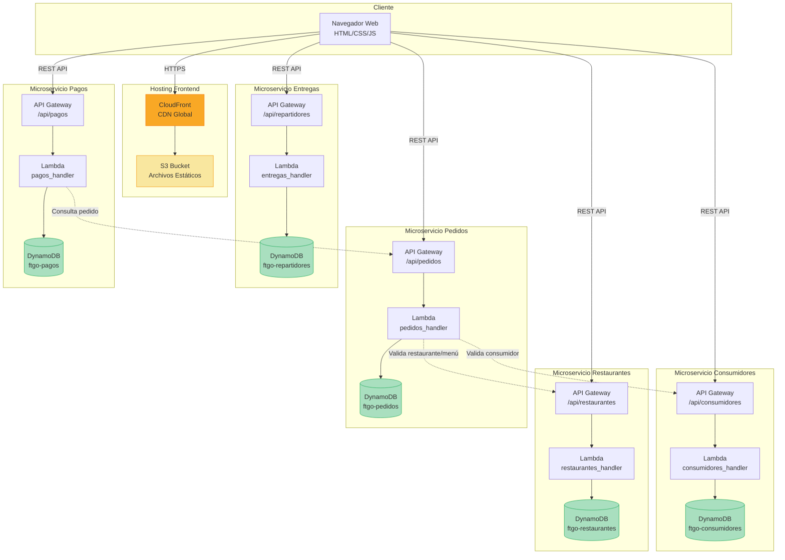
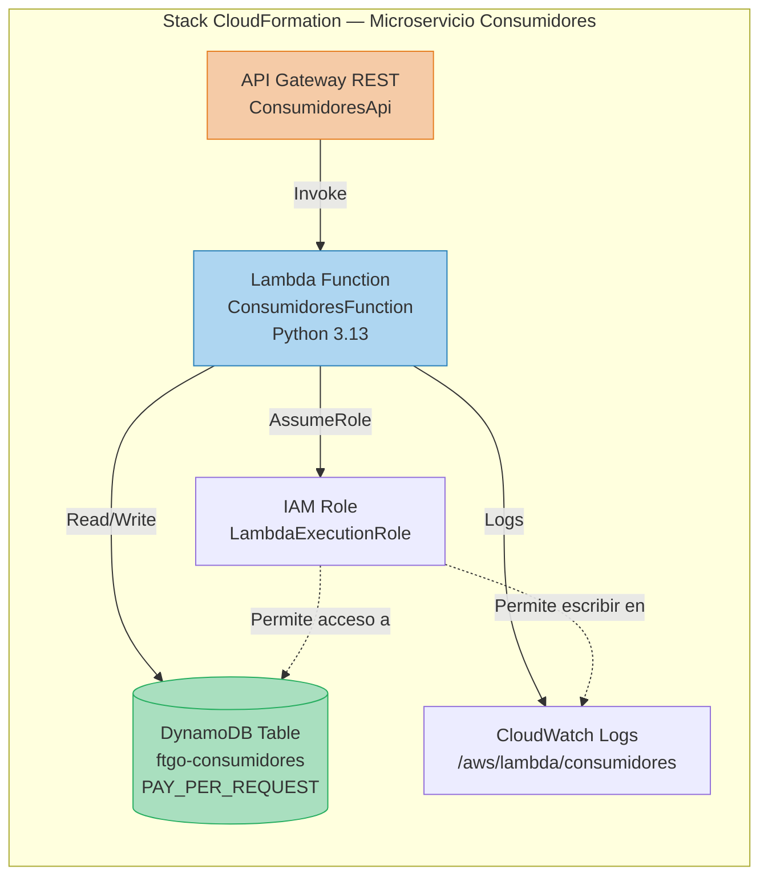
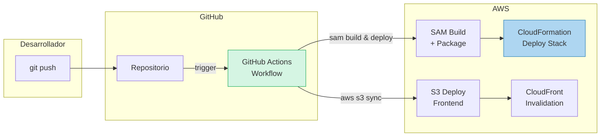
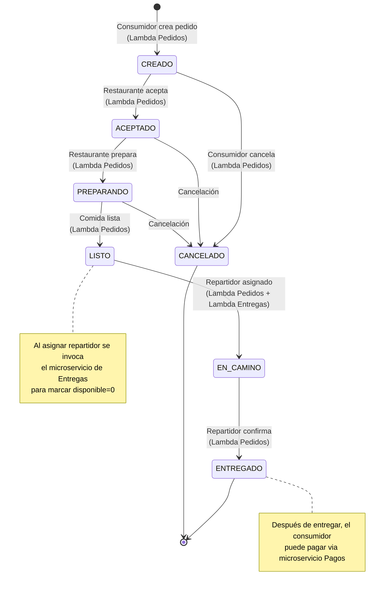
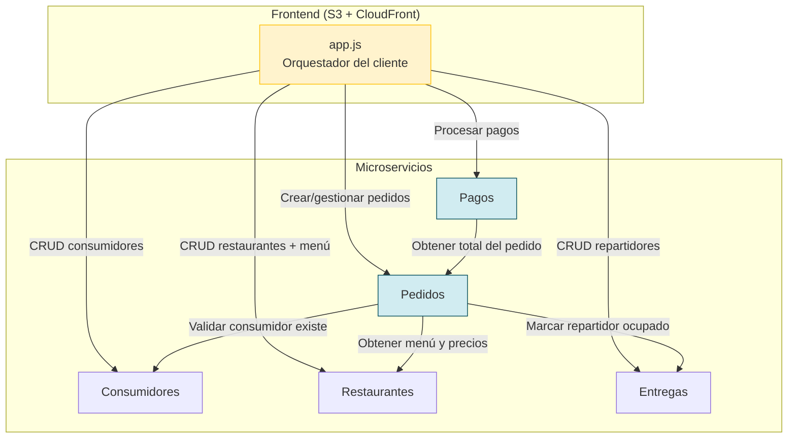
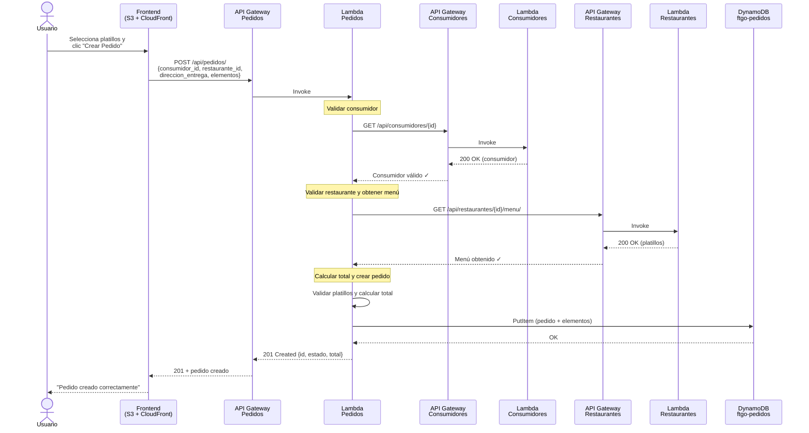
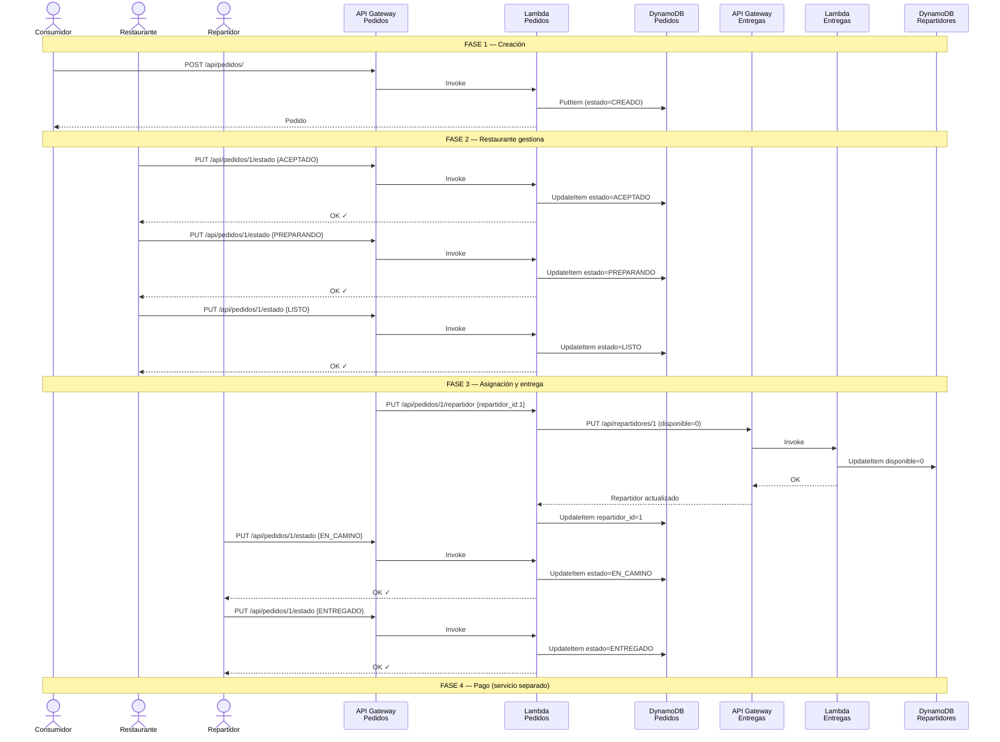
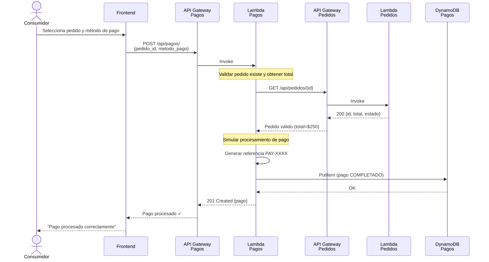
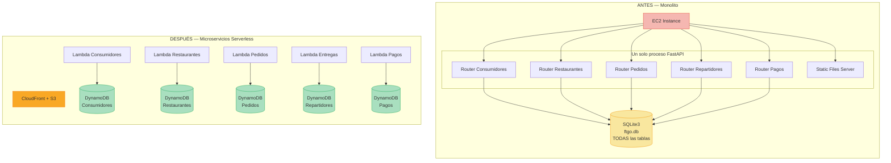

# Diseño de Arquitectura — FTGO Microservicios (Serverless AWS)

## 1. Visión General

Se refactoriza el monolito FTGO en microservicios serverless sobre AWS, siguiendo el patrón
"Database per Service". Cada dominio de negocio se implementa como un servicio independiente
con su propia base de datos DynamoDB, expuesto a través de API Gateway, y desplegado con
AWS SAM (Serverless Application Model) + CloudFormation.

---

## 2. Dominios de Negocio Identificados

| # | Dominio | Descripción | Entidades |
|---|---------|-------------|-----------|
| 1 | **Consumidores** | Gestión de clientes | Consumidor |
| 2 | **Restaurantes** | Gestión de restaurantes y menús | Restaurante, ElementoMenu |
| 3 | **Pedidos** | Ciclo de vida de pedidos | Pedido, ElementoPedido |
| 4 | **Entregas** | Gestión de repartidores y asignación | Repartidor |
| 5 | **Pagos** | Procesamiento de pagos | Pago |

Cada dominio:
- Tiene su propio repositorio de código (estructura de directorios independiente)
- Tiene su propia tabla DynamoDB
- Se expone como un API Gateway independiente
- Se despliega de forma independiente con su propio stack CloudFormation
- Puede evolucionar a una cuenta AWS separada

---

## 3. Diagrama de Arquitectura General



---

## 3.1 Diagrama de Infraestructura por Dominio (Detalle de un Microservicio)



---

## 3.2 Diagrama de Despliegue (CI/CD con GitHub Actions)



---

## 4. Diseño de Tablas DynamoDB

### 4.0 Diagrama Entidad-Relación (DynamoDB — Separación por Dominio)

```mermaid
erDiagram
    CONSUMIDORES_TABLE {
        string id PK "UUID"
        string nombre
        string email "GSI: email-index"
        string telefono
        string direccion
        string fecha_registro "ISO 8601"
    }

    RESTAURANTES_TABLE {
        string PK PK "REST#id"
        string SK SK "METADATA | MENU#id"
        string tipo_entidad "restaurante | elemento_menu"
        string nombre
        string direccion
        string telefono
        string tipo_cocina
        string horario_apertura
        string horario_cierre
        string descripcion
        number precio
        number disponible
        string fecha_registro
    }

    PEDIDOS_TABLE {
        string PK PK "PED#id"
        string SK SK "METADATA | ELEM#id"
        string tipo_entidad "pedido | elemento_pedido"
        string consumidor_id "GSI: consumidor-index"
        string restaurante_id
        string repartidor_id
        string estado
        number total
        string direccion_entrega
        string elemento_menu_id
        number cantidad
        number precio_unitario
        number subtotal
        string fecha_creacion
        string fecha_actualizacion
    }

    REPARTIDORES_TABLE {
        string id PK "UUID"
        string nombre
        string telefono
        string vehiculo
        number disponible "GSI: disponible-index"
        string fecha_registro "ISO 8601"
    }

    PAGOS_TABLE {
        string id PK "UUID"
        string pedido_id "GSI: pedido-index"
        number monto
        string metodo_pago
        string estado
        string referencia
        string fecha_pago "ISO 8601"
    }

    CONSUMIDORES_TABLE ||--o{ PEDIDOS_TABLE : "referenciado por consumidor_id"
    RESTAURANTES_TABLE ||--o{ PEDIDOS_TABLE : "referenciado por restaurante_id"
    REPARTIDORES_TABLE ||--o{ PEDIDOS_TABLE : "referenciado por repartidor_id"
    PEDIDOS_TABLE ||--o| PAGOS_TABLE : "referenciado por pedido_id"
```

> **Nota:** En microservicios con DynamoDB, las relaciones son lógicas (no hay foreign keys).
> Cada tabla es independiente y pertenece a un servicio diferente. La integridad referencial
> se garantiza a nivel de aplicación (validación HTTP entre servicios).

### 4.1 Tabla: ftgo-consumidores

| Atributo | Tipo | Clave |
|----------|------|-------|
| id | String (UUID) | PK |
| nombre | String | - |
| email | String | GSI-PK (email-index) |
| telefono | String | - |
| direccion | String | - |
| fecha_registro | String (ISO 8601) | - |

### 4.2 Tabla: ftgo-restaurantes

Diseño de tabla única (single-table design) para restaurantes y menú:

| Atributo | Tipo | Clave |
|----------|------|-------|
| PK | String | PK |
| SK | String | SK |
| tipo_entidad | String | - |
| ...atributos | - | - |

Patrones de acceso:
- `PK=REST#<id>`, `SK=METADATA` → Datos del restaurante
- `PK=REST#<id>`, `SK=MENU#<menu_id>` → Elemento del menú

### 4.3 Tabla: ftgo-pedidos

| Atributo | Tipo | Clave |
|----------|------|-------|
| PK | String | PK |
| SK | String | SK |
| tipo_entidad | String | - |
| ...atributos | - | - |

Patrones de acceso:
- `PK=PED#<id>`, `SK=METADATA` → Datos del pedido
- `PK=PED#<id>`, `SK=ELEM#<elem_id>` → Elemento del pedido
- GSI: `consumidor_id-index` para buscar pedidos por consumidor

### 4.4 Tabla: ftgo-repartidores

| Atributo | Tipo | Clave |
|----------|------|-------|
| id | String (UUID) | PK |
| nombre | String | - |
| telefono | String | - |
| vehiculo | String | - |
| disponible | Number (0/1) | GSI-PK (disponible-index) |
| fecha_registro | String (ISO 8601) | - |

### 4.5 Tabla: ftgo-pagos

| Atributo | Tipo | Clave |
|----------|------|-------|
| id | String (UUID) | PK |
| pedido_id | String | GSI-PK (pedido-index) |
| monto | Number | - |
| metodo_pago | String | - |
| estado | String | - |
| referencia | String | - |
| fecha_pago | String (ISO 8601) | - |

---

## 5. API Endpoints (se mantienen iguales al monolito)

Cada API Gateway expone los mismos endpoints que el monolito, con CORS habilitado
para que el frontend en S3/CloudFront pueda invocarlos.

### Consumidores API (`https://<api-id>.execute-api.<region>.amazonaws.com/prod`)
| Método | Ruta | Lambda Handler |
|--------|------|----------------|
| POST | /api/consumidores/ | crear_consumidor |
| GET | /api/consumidores/ | listar_consumidores |
| GET | /api/consumidores/{id} | obtener_consumidor |
| PUT | /api/consumidores/{id} | actualizar_consumidor |
| DELETE | /api/consumidores/{id} | eliminar_consumidor |

### Restaurantes API
| Método | Ruta | Lambda Handler |
|--------|------|----------------|
| POST | /api/restaurantes/ | crear_restaurante |
| GET | /api/restaurantes/ | listar_restaurantes |
| GET | /api/restaurantes/{id} | obtener_restaurante |
| PUT | /api/restaurantes/{id} | actualizar_restaurante |
| DELETE | /api/restaurantes/{id} | eliminar_restaurante |
| POST | /api/restaurantes/{id}/menu/ | agregar_elemento_menu |
| GET | /api/restaurantes/{id}/menu/ | obtener_menu |
| PUT | /api/restaurantes/menu/{id} | actualizar_elemento_menu |
| DELETE | /api/restaurantes/menu/{id} | eliminar_elemento_menu |

### Pedidos API
| Método | Ruta | Lambda Handler |
|--------|------|----------------|
| POST | /api/pedidos/ | crear_pedido |
| GET | /api/pedidos/ | listar_pedidos |
| GET | /api/pedidos/{id} | obtener_pedido |
| PUT | /api/pedidos/{id}/estado | actualizar_estado |
| PUT | /api/pedidos/{id}/repartidor | asignar_repartidor |
| DELETE | /api/pedidos/{id} | cancelar_pedido |

### Entregas API
| Método | Ruta | Lambda Handler |
|--------|------|----------------|
| POST | /api/repartidores/ | crear_repartidor |
| GET | /api/repartidores/ | listar_repartidores |
| GET | /api/repartidores/{id} | obtener_repartidor |
| PUT | /api/repartidores/{id} | actualizar_repartidor |
| DELETE | /api/repartidores/{id} | eliminar_repartidor |

### Pagos API
| Método | Ruta | Lambda Handler |
|--------|------|----------------|
| POST | /api/pagos/ | procesar_pago |
| GET | /api/pagos/ | listar_pagos |
| GET | /api/pagos/{id} | obtener_pago |

---

## 6. Estructura de Directorios

```
ftgo-microservicios/
├── DESIGN.md                          ← Este documento
├── README.md                          ← Instrucciones generales
├── DEPLOY.md                          ← Guía de despliegue
│
├── frontend/                          ← Repositorio del frontend
│   ├── template.yaml                  ← CloudFormation (S3 + CloudFront)
│   ├── static/
│   │   ├── index.html
│   │   ├── style.css
│   │   └── app.js                     ← Actualizado para invocar múltiples APIs
│   └── .github/
│       └── workflows/
│           └── deploy.yml             ← Pipeline CI/CD frontend
│
├── servicios/
│   ├── consumidores/                  ← Microservicio Consumidores
│   │   ├── template.yaml             ← SAM/CloudFormation
│   │   ├── src/
│   │   │   ├── __init__.py
│   │   │   └── handler.py            ← Lambda handler
│   │   ├── tests/
│   │   │   └── test_handler.py
│   │   ├── pyproject.toml
│   │   └── .github/
│   │       └── workflows/
│   │           └── deploy.yml
│   │
│   ├── restaurantes/                  ← Microservicio Restaurantes
│   │   ├── template.yaml
│   │   ├── src/
│   │   │   ├── __init__.py
│   │   │   └── handler.py
│   │   ├── tests/
│   │   │   └── test_handler.py
│   │   ├── pyproject.toml
│   │   └── .github/
│   │       └── workflows/
│   │           └── deploy.yml
│   │
│   ├── pedidos/                       ← Microservicio Pedidos
│   │   ├── template.yaml
│   │   ├── src/
│   │   │   ├── __init__.py
│   │   │   └── handler.py
│   │   ├── tests/
│   │   │   └── test_handler.py
│   │   ├── pyproject.toml
│   │   └── .github/
│   │       └── workflows/
│   │           └── deploy.yml
│   │
│   ├── entregas/                      ← Microservicio Entregas (Repartidores)
│   │   ├── template.yaml
│   │   ├── src/
│   │   │   ├── __init__.py
│   │   │   └── handler.py
│   │   ├── tests/
│   │   │   └── test_handler.py
│   │   ├── pyproject.toml
│   │   └── .github/
│   │       └── workflows/
│   │           └── deploy.yml
│   │
│   └── pagos/                         ← Microservicio Pagos
│       ├── template.yaml
│       ├── src/
│       │   ├── __init__.py
│       │   └── handler.py
│       ├── tests/
│       │   └── test_handler.py
│       ├── pyproject.toml
│       └── .github/
│           └── workflows/
│               └── deploy.yml
│
└── scripts/
    └── migrar_sqlite_a_dynamodb.py    ← Script de migración de datos
```

---

## 7. Tecnologías y Herramientas

| Componente | Tecnología |
|------------|-----------|
| Compute | AWS Lambda (Python 3.13) |
| API | API Gateway (REST) |
| Base de datos | DynamoDB (una tabla por dominio) |
| Frontend hosting | S3 + CloudFront |
| IaC | AWS SAM / CloudFormation |
| CI/CD | GitHub Actions |
| Dependencias | uv (pyproject.toml por servicio) |
| SDK AWS | boto3 |

---

## 8. Configuración del Frontend

El frontend se modifica para:
1. Usar URLs de API Gateway en lugar de rutas relativas
2. Configurar las URLs de cada microservicio via un archivo `config.js`
3. Habilitar CORS en cada API Gateway

```javascript
// config.js — URLs de los API Gateway de cada microservicio
const CONFIG = {
    API_CONSUMIDORES: "https://<api-id>.execute-api.<region>.amazonaws.com/prod",
    API_RESTAURANTES: "https://<api-id>.execute-api.<region>.amazonaws.com/prod",
    API_PEDIDOS: "https://<api-id>.execute-api.<region>.amazonaws.com/prod",
    API_ENTREGAS: "https://<api-id>.execute-api.<region>.amazonaws.com/prod",
    API_PAGOS: "https://<api-id>.execute-api.<region>.amazonaws.com/prod",
};
```

---

## 9. Pipeline de Despliegue (GitHub Actions)

Cada servicio tiene su propio pipeline que:
1. Se activa al hacer push a `main` (o al directorio del servicio)
2. Instala dependencias con `uv`
3. Ejecuta tests
4. Empaqueta con `sam build`
5. Despliega con `sam deploy`

```yaml
# Flujo simplificado
on:
  push:
    branches: [main]
    paths: ['servicios/consumidores/**']

jobs:
  deploy:
    runs-on: ubuntu-latest
    steps:
      - uses: actions/checkout@v4
      - uses: aws-actions/setup-sam@v2
      - uses: aws-actions/configure-aws-credentials@v4
      - run: sam build
      - run: sam deploy --no-confirm-changeset
```

---

## 10. Script de Migración SQLite → DynamoDB

El script `migrar_sqlite_a_dynamodb.py`:
1. Lee los datos de `ftgo-monolito/ftgo.db` usando SQLAlchemy
2. Transforma los registros al formato DynamoDB (con PKs/SKs apropiados)
3. Escribe en batch a cada tabla DynamoDB usando boto3

---

## 11. Consideraciones de Diseño

### 11.0 Diagrama de Estados del Pedido (sin cambios respecto al monolito)



### 11.1 Diagrama de Comunicación entre Microservicios



### 11.1 Comunicación entre servicios
- En esta versión inicial, el frontend orquesta las llamadas (coreografía desde el cliente)
- El servicio de Pedidos necesita validar que existan el consumidor y restaurante:
  se hace una llamada HTTP interna al API Gateway de esos servicios
- En una evolución futura se podría usar EventBridge para comunicación asíncrona

### 11.2 Consistencia eventual
- Al separar las bases de datos, se pierde la transaccionalidad ACID entre dominios
- Se acepta consistencia eventual (patrón Saga simplificado)
- Si falla la validación del consumidor al crear un pedido, se retorna error inmediato

### 11.3 CORS
- Cada API Gateway configura CORS para permitir el dominio de CloudFront
- Headers: `Access-Control-Allow-Origin`, `Access-Control-Allow-Methods`, `Access-Control-Allow-Headers`

### 11.4 Evolución a multi-cuenta
- Cada stack CloudFormation es independiente
- Los API Gateway IDs se parametrizan en el frontend
- En el futuro, cada dominio puede vivir en su propia cuenta AWS con su propio pipeline

---

## 12. Diagrama de Secuencia — Crear Pedido (Microservicios)



---

## 12.1 Diagrama de Secuencia — Ciclo de Vida del Pedido (Microservicios)



---

## 12.2 Diagrama de Secuencia — Procesar Pago (Microservicios)



---

## 13. Resumen de Cambios vs. Monolito

### 13.0 Diagrama Comparativo: Monolito vs. Microservicios



| Aspecto | Monolito | Microservicios |
|---------|----------|----------------|
| Compute | EC2 + uvicorn | AWS Lambda |
| Framework | FastAPI | Lambda handlers nativos |
| Base de datos | SQLite3 (un archivo) | DynamoDB (una tabla por dominio) |
| API | FastAPI routers | API Gateway REST |
| Frontend | Servido por FastAPI | S3 + CloudFront |
| Despliegue | scp + systemd | SAM + GitHub Actions |
| Escalamiento | Vertical (instancia más grande) | Automático (Lambda) |
| Costo en reposo | ~$25/mes (EC2 siempre encendida) | ~$0 (pay-per-request) |
| IaC | Manual | CloudFormation/SAM |

---

**¿Procedo con la generación del código?** Confirma y empiezo a crear los archivos de cada microservicio, el frontend actualizado, los templates SAM, los pipelines de GitHub Actions y el script de migración.
