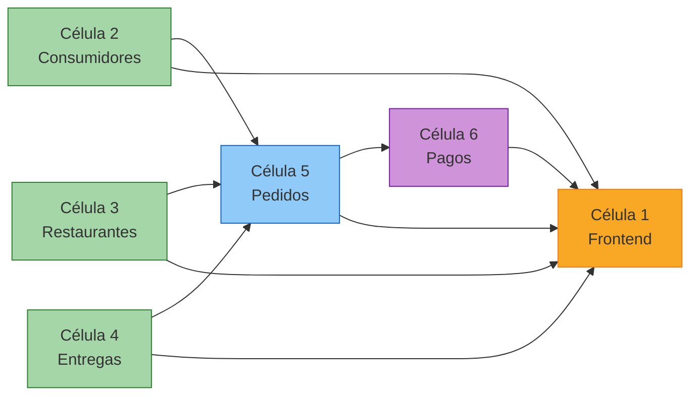

# 🎯 Dinámica del Meetup — 27 de Abril de 2026

## ULSA MX Cómputo en la Nube: Despliegue de Microservicios FTGO

---

## Objetivo

Cada equipo debe desplegar el sistema FTGO completo (frontend + 5 microservicios backend)
de forma manual en su cuenta de AWS, trabajando en células de trabajo paralelas.

Al final del ejercicio, cada equipo tendrá su propia instancia funcional del sistema
FTGO corriendo como microservicios serverless en AWS.

---

## Organización General

```
┌─────────────────────────────────────────────────────────────────┐
│                     GRUPO COMPLETO                              │
├────────────────────────────┬────────────────────────────────────┤
│        EQUIPO A            │           EQUIPO B                 │
│   (Cuenta AWS #1)          │      (Cuenta AWS #2)               │
├────────────────────────────┼────────────────────────────────────┤
│ Célula 1: Frontend         │ Célula 1: Frontend                 │
│ Célula 2: Consumidores     │ Célula 2: Consumidores             │
│ Célula 3: Restaurantes     │ Célula 3: Restaurantes             │
│ Célula 4: Entregas         │ Célula 4: Entregas                 │
│ Célula 5: Pedidos          │ Célula 5: Pedidos                  │
│ Célula 6: Pagos            │ Célula 6: Pagos                    │
└────────────────────────────┴────────────────────────────────────┘
```

- 2 equipos grandes, cada uno con su propia cuenta de AWS.
- Cada equipo se divide en 6 células de trabajo.
- Cada célula es responsable de desplegar UN componente del sistema.
- Las células trabajan en paralelo pero deben coordinarse para las dependencias.

---

## Células de Trabajo y Responsabilidades

### Célula 1 — Frontend (🖥️)

| Aspecto | Detalle |
|---------|---------|
| Componente | `frontend/` |
| Stack CloudFormation | `ftgo-frontend` |
| Responsabilidad | Desplegar la Lambda que sirve el HTML y actualizar las URLs de cada API Gateway |
| Dependencias | Necesita las URLs de TODOS los microservicios (células 2-6) |
| Orden de despliegue | ÚLTIMO (después de que todas las células reporten sus URLs) |

#### Pasos de la Célula 1

1. Conectarse a la instancia EC2 del equipo por SSH.
2. Configurar credenciales AWS (IAM Identity Center).
3. Clonar el repositorio y navegar a `frontend/`.
4. Esperar a que las células 2-6 reporten sus URLs de API Gateway.
5. Editar `frontend/src/static/index.html` — actualizar el bloque `CONFIG`:
   ```javascript
   const CONFIG = {
       API_CONSUMIDORES: "https://<URL_CELULA_2>/Prod",
       API_RESTAURANTES: "https://<URL_CELULA_3>/Prod",
       API_ENTREGAS:     "https://<URL_CELULA_4>/Prod",
       API_PEDIDOS:      "https://<URL_CELULA_5>/Prod",
       API_PAGOS:        "https://<URL_CELULA_6>/Prod",
   };
   ```
6. Construir y desplegar:
   ```bash
   sam build
   sam deploy --guided
   # Stack Name: ftgo-frontend
   # Region: us-east-1
   ```
7. Compartir la URL del frontend con todo el equipo.
8. Verificar que el sistema completo funciona navegando a la URL.

#### Checklist de la Célula 1

- [ ] EC2 configurada con credenciales AWS
- [ ] Repositorio clonado
- [ ] URLs de las 5 APIs recibidas de las otras células
- [ ] `index.html` actualizado con las URLs reales
- [ ] `sam build` exitoso
- [ ] `sam deploy` exitoso
- [ ] URL del frontend compartida con el equipo
- [ ] Verificación: todas las secciones del frontend cargan datos

---

### Célula 2 — Microservicio Consumidores (👤)

| Aspecto | Detalle |
|---------|---------|
| Componente | `servicios/consumidores/` |
| Stack CloudFormation | `ftgo-consumidores` |
| Tabla DynamoDB | `ftgo-consumidores` (PK: `id`, GSI: `email-index`) |
| Responsabilidad | Desplegar Lambda + API Gateway + DynamoDB y migrar datos |
| Dependencias | Ninguna (dominio independiente) |
| Orden de despliegue | Puede desplegarse de inmediato (sin dependencias) |

#### Pasos de la Célula 2

1. Conectarse a la EC2 y configurar credenciales AWS.
2. Navegar a `servicios/consumidores/`.
3. Construir y desplegar:
   ```bash
   sam build
   sam deploy --guided
   # Stack Name: ftgo-consumidores
   # Region: us-east-1
   # Allow SAM CLI IAM role creation: Y
   ```
4. Anotar la URL del API Gateway (aparece en los Outputs del stack).
5. Comunicar la URL a la Célula 1 (Frontend) y Célula 5 (Pedidos).
6. Migrar datos del monolito:
   ```bash
   cd ../../scripts
   pip install boto3
   python migrar_por_dominio.py consumidores
   ```
7. Compartir el archivo `mapeo_consumidores.json` con la Célula 5 (Pedidos).
8. Verificar con curl:
   ```bash
   curl https://<TU_API_URL>/Prod/api/consumidores/
   ```

#### Checklist de la Célula 2

- [ ] `sam deploy` exitoso
- [ ] URL del API Gateway anotada y compartida con Célula 1 y Célula 5
- [ ] Datos migrados con `migrar_por_dominio.py consumidores`
- [ ] Archivo `mapeo_consumidores.json` compartido con Célula 5
- [ ] Verificación: `curl` devuelve lista de consumidores

---

### Célula 3 — Microservicio Restaurantes (🏪)

| Aspecto | Detalle |
|---------|---------|
| Componente | `servicios/restaurantes/` |
| Stack CloudFormation | `ftgo-restaurantes` |
| Tabla DynamoDB | `ftgo-restaurantes` (PK: `PK`, SK: `SK` — single-table design) |
| Responsabilidad | Desplegar Lambda + API Gateway + DynamoDB y migrar restaurantes + menús |
| Dependencias | Ninguna (dominio independiente) |
| Orden de despliegue | Puede desplegarse de inmediato (sin dependencias) |

#### Pasos de la Célula 3

1. Conectarse a la EC2 y configurar credenciales AWS.
2. Navegar a `servicios/restaurantes/`.
3. Construir y desplegar:
   ```bash
   sam build
   sam deploy --guided
   # Stack Name: ftgo-restaurantes
   # Region: us-east-1
   ```
4. Anotar la URL del API Gateway.
5. Comunicar la URL a la Célula 1 (Frontend) y Célula 5 (Pedidos).
6. Migrar datos:
   ```bash
   cd ../../scripts
   python migrar_por_dominio.py restaurantes
   ```
7. Compartir `mapeo_restaurantes.json` y `mapeo_menu.json` con la Célula 5.
8. Verificar:
   ```bash
   curl https://<TU_API_URL>/Prod/api/restaurantes/
   ```

#### Checklist de la Célula 3

- [ ] `sam deploy` exitoso
- [ ] URL del API Gateway compartida con Célula 1 y Célula 5
- [ ] Datos migrados (restaurantes + menús)
- [ ] Archivos `mapeo_restaurantes.json` y `mapeo_menu.json` compartidos con Célula 5
- [ ] Verificación: `curl` devuelve lista de restaurantes

---

### Célula 4 — Microservicio Entregas / Repartidores (🚴)

| Aspecto | Detalle |
|---------|---------|
| Componente | `servicios/entregas/` |
| Stack CloudFormation | `ftgo-repartidores` |
| Tabla DynamoDB | `ftgo-repartidores` (PK: `id`) |
| Responsabilidad | Desplegar Lambda + API Gateway + DynamoDB y migrar repartidores |
| Dependencias | Ninguna (dominio independiente) |
| Orden de despliegue | Puede desplegarse de inmediato (sin dependencias) |

#### Pasos de la Célula 4

1. Conectarse a la EC2 y configurar credenciales AWS.
2. Navegar a `servicios/entregas/`.
3. Construir y desplegar:
   ```bash
   sam build
   sam deploy --guided
   # Stack Name: ftgo-repartidores
   # Region: us-east-1
   ```
4. Anotar la URL del API Gateway.
5. Comunicar la URL a la Célula 1 (Frontend) y Célula 5 (Pedidos).
6. Migrar datos:
   ```bash
   cd ../../scripts
   python migrar_por_dominio.py entregas
   ```
7. Compartir `mapeo_repartidores.json` con la Célula 5.
8. Verificar:
   ```bash
   curl https://<TU_API_URL>/Prod/api/repartidores/
   ```

#### Checklist de la Célula 4

- [ ] `sam deploy` exitoso
- [ ] URL del API Gateway compartida con Célula 1 y Célula 5
- [ ] Datos migrados
- [ ] Archivo `mapeo_repartidores.json` compartido con Célula 5
- [ ] Verificación: `curl` devuelve lista de repartidores

---

### Célula 5 — Microservicio Pedidos (📦)

| Aspecto | Detalle |
|---------|---------|
| Componente | `servicios/pedidos/` |
| Stack CloudFormation | `ftgo-pedidos` |
| Tabla DynamoDB | `ftgo-pedidos` (PK: `PK`, SK: `SK`, GSI: `consumidor-index`) |
| Responsabilidad | Desplegar Lambda + API Gateway + DynamoDB, configurar URLs de otros servicios, migrar datos |
| Dependencias | Necesita las URLs de Consumidores (Célula 2), Restaurantes (Célula 3) y Entregas (Célula 4) |
| Orden de despliegue | DESPUÉS de las células 2, 3 y 4 |

#### Pasos de la Célula 5

1. Conectarse a la EC2 y configurar credenciales AWS.
2. Esperar a que las células 2, 3 y 4 reporten sus URLs de API Gateway.
3. Navegar a `servicios/pedidos/`.
4. Construir y desplegar con los parámetros de URLs:
   ```bash
   sam build
   sam deploy --guided \
     --parameter-overrides \
       ApiConsumidoresUrl=https://<URL_CELULA_2>/Prod \
       ApiRestaurantesUrl=https://<URL_CELULA_3>/Prod \
       ApiEntregasUrl=https://<URL_CELULA_4>/Prod
   # Stack Name: ftgo-pedidos
   # Region: us-east-1
   ```
   O si ya hiciste `--guided` antes:
   ```bash
   sam deploy --no-confirm-changeset --capabilities CAPABILITY_IAM --resolve-s3 \
     --parameter-overrides \
       ApiConsumidoresUrl=https://<URL_CELULA_2>/Prod \
       ApiRestaurantesUrl=https://<URL_CELULA_3>/Prod \
       ApiEntregasUrl=https://<URL_CELULA_4>/Prod
   ```
5. Anotar la URL del API Gateway.
6. Comunicar la URL a la Célula 1 (Frontend) y Célula 6 (Pagos).
7. Recopilar los archivos de mapeo de las células 2, 3 y 4:
   - `mapeo_consumidores.json` (de Célula 2)
   - `mapeo_restaurantes.json` (de Célula 3)
   - `mapeo_menu.json` (de Célula 3)
   - `mapeo_repartidores.json` (de Célula 4)
8. Migrar datos:
   ```bash
   cd ../../scripts
   python migrar_por_dominio.py pedidos \
     --mapeo-consumidores mapeo_consumidores.json \
     --mapeo-restaurantes mapeo_restaurantes.json \
     --mapeo-menu mapeo_menu.json \
     --mapeo-repartidores mapeo_repartidores.json
   ```
9. Compartir `mapeo_pedidos.json` con la Célula 6.
10. Verificar:
    ```bash
    curl https://<TU_API_URL>/Prod/api/pedidos/
    ```

#### Checklist de la Célula 5

- [ ] URLs de Consumidores, Restaurantes y Entregas recibidas
- [ ] `sam deploy` exitoso con parámetros de URLs
- [ ] URL del API Gateway compartida con Célula 1 y Célula 6
- [ ] Archivos de mapeo recibidos de células 2, 3 y 4
- [ ] Datos migrados con `migrar_por_dominio.py pedidos`
- [ ] Archivo `mapeo_pedidos.json` compartido con Célula 6
- [ ] Verificación: `curl` devuelve lista de pedidos

---

### Célula 6 — Microservicio Pagos (💳)

| Aspecto | Detalle |
|---------|---------|
| Componente | `servicios/pagos/` |
| Stack CloudFormation | `ftgo-pagos` |
| Tabla DynamoDB | `ftgo-pagos` (PK: `id`, GSI: `pedido-index`) |
| Responsabilidad | Desplegar Lambda + API Gateway + DynamoDB, configurar URL de Pedidos, migrar datos |
| Dependencias | Necesita la URL de Pedidos (Célula 5) |
| Orden de despliegue | DESPUÉS de la Célula 5 |

#### Pasos de la Célula 6

1. Conectarse a la EC2 y configurar credenciales AWS.
2. Esperar a que la Célula 5 reporte su URL de API Gateway.
3. Navegar a `servicios/pagos/`.
4. Construir y desplegar:
   ```bash
   sam build
   sam deploy --guided \
     --parameter-overrides \
       ApiPedidosUrl=https://<URL_CELULA_5>/Prod
   # Stack Name: ftgo-pagos
   # Region: us-east-1
   ```

   > **Nota:** Si el template.yaml de pagos no tiene el parámetro `ApiPedidosUrl`,
   > la URL se configura como variable de entorno `API_PEDIDOS_URL` en la Lambda.
   > Verifica el template antes de desplegar.

5. Anotar la URL del API Gateway.
6. Comunicar la URL a la Célula 1 (Frontend).
7. Recopilar `mapeo_pedidos.json` de la Célula 5.
8. Migrar datos:
   ```bash
   cd ../../scripts
   python migrar_por_dominio.py pagos \
     --mapeo-pedidos mapeo_pedidos.json
   ```
9. Verificar:
   ```bash
   curl https://<TU_API_URL>/Prod/api/pagos/
   ```

#### Checklist de la Célula 6

- [ ] URL de Pedidos recibida de Célula 5
- [ ] `sam deploy` exitoso con parámetro de URL
- [ ] URL del API Gateway compartida con Célula 1
- [ ] Datos migrados con `migrar_por_dominio.py pagos`
- [ ] Verificación: `curl` devuelve lista de pagos

---

## Diagrama de Dependencias entre Células

```
Tiempo →

Fase 1 (paralelo):     Célula 2 (Consumidores) ──┐
                        Célula 3 (Restaurantes) ──┤
                        Célula 4 (Entregas)     ──┤
                                                   │
Fase 2 (espera URLs):                             ├──→ Célula 5 (Pedidos)
                                                   │         │
Fase 3 (espera URL):                              │         └──→ Célula 6 (Pagos)
                                                   │                    │
Fase 4 (espera TODAS):                            └────────────────────┴──→ Célula 1 (Frontend)
```



---

## Cronograma Sugerido

| Tiempo | Actividad |
|--------|-----------|
| 0:00 - 0:15 | Presentación del ejercicio, formación de equipos y asignación de células |
| 0:15 - 0:25 | Cada célula se conecta a la EC2, configura credenciales AWS y clona el repo |
| 0:25 - 0:55 | **Fase 1:** Células 2, 3 y 4 despliegan sus microservicios en paralelo |
| 0:55 - 1:10 | **Fase 1 (cont.):** Células 2, 3 y 4 ejecutan migración de datos y comparten URLs + mapeos |
| 1:10 - 1:30 | **Fase 2:** Célula 5 despliega Pedidos con las URLs de los otros servicios y migra datos |
| 1:30 - 1:45 | **Fase 3:** Célula 6 despliega Pagos con la URL de Pedidos y migra datos |
| 1:45 - 2:00 | **Fase 4:** Célula 1 actualiza las URLs en el frontend, despliega y verifica |
| 2:00 - 2:15 | Verificación completa: cada equipo navega su frontend y prueba el flujo completo |
| 2:15 - 2:30 | Retrospectiva: comparar experiencias entre equipos, discutir problemas encontrados |

> **Tiempo total estimado: 2 horas 30 minutos**

---

## Preparación Previa del Instructor

### Antes del meetup

1. Crear 2 cuentas AWS (o 2 OUs en AWS Organizations).
2. Configurar IAM Identity Center con usuarios para cada equipo.
3. Crear un Permission Set con los permisos necesarios (ver `PERMISOS_IAM_IDENTITY_CENTER.md`).
4. Lanzar 2 instancias EC2 (una por equipo) con Amazon Linux 2023.
5. Pre-instalar herramientas en cada EC2:
   ```bash
   sudo dnf update -y
   sudo dnf install git python3.13 python3.13-pip -y
   curl -LsSf https://astral.sh/uv/install.sh | sh
   source ~/.bashrc
   pip3.13 install aws-sam-cli boto3 --user
   ```
6. Clonar el repositorio en cada EC2.
7. Copiar el archivo `ftgo.db` del monolito a cada EC2:
   ```bash
   # En la EC2 de cada equipo
   cp /ruta/al/ftgo-monolito/ftgo.db ~/ftgo-microservicios/ftgo-monolito/ftgo.db
   ```
8. Verificar que `sam --version` y `aws sts get-caller-identity` funcionan.

### Materiales para cada equipo

- Credenciales de IAM Identity Center (portal URL + usuario/contraseña).
- IP de la instancia EC2 y clave SSH (`.pem`).
- Copia impresa o digital de este documento.
- Acceso al repositorio Git.

---

## Coordinación entre Células

### Canal de comunicación

Cada equipo debe tener un canal de comunicación (Slack, WhatsApp, Discord, etc.)
donde las células compartan:

1. **URLs de API Gateway** — Cada célula publica su URL al terminar el despliegue.
2. **Archivos de mapeo JSON** — Las células 2, 3 y 4 comparten sus archivos de mapeo
   con la Célula 5, y la Célula 5 comparte el suyo con la Célula 6.
3. **Estado de avance** — Cada célula reporta cuando termina cada paso.

### Formato sugerido para compartir URLs

```
✅ Célula 2 (Consumidores) lista:
   URL: https://abc123def4.execute-api.us-east-1.amazonaws.com/Prod
   Mapeo: mapeo_consumidores.json (adjunto)
```

### Tabla de URLs del equipo (para la Célula 1)

| Célula | Microservicio | URL del API Gateway |
|--------|---------------|---------------------|
| 2 | Consumidores | `https://__________.execute-api.us-east-1.amazonaws.com/Prod` |
| 3 | Restaurantes | `https://__________.execute-api.us-east-1.amazonaws.com/Prod` |
| 4 | Entregas | `https://__________.execute-api.us-east-1.amazonaws.com/Prod` |
| 5 | Pedidos | `https://__________.execute-api.us-east-1.amazonaws.com/Prod` |
| 6 | Pagos | `https://__________.execute-api.us-east-1.amazonaws.com/Prod` |

---

## Script de Migración por Dominio

Cada célula usa el script `scripts/migrar_por_dominio.py` para migrar
SOLO los datos de su dominio desde el monolito (ftgo.db) a DynamoDB.

### Uso básico

```bash
cd ftgo-microservicios/scripts
pip install boto3

# Dominios sin dependencias (células 2, 3, 4)
python migrar_por_dominio.py consumidores
python migrar_por_dominio.py restaurantes
python migrar_por_dominio.py entregas

# Dominio con dependencias (célula 5) — necesita mapeos de las otras células
python migrar_por_dominio.py pedidos \
  --mapeo-consumidores mapeo_consumidores.json \
  --mapeo-restaurantes mapeo_restaurantes.json \
  --mapeo-menu mapeo_menu.json \
  --mapeo-repartidores mapeo_repartidores.json

# Dominio con dependencias (célula 6) — necesita mapeo de pedidos
python migrar_por_dominio.py pagos \
  --mapeo-pedidos mapeo_pedidos.json
```

### ¿Qué hace el script?

1. Lee SOLO las tablas SQLite correspondientes al dominio seleccionado.
2. Genera UUIDs nuevos para cada registro (DynamoDB no usa auto-increment).
3. Transforma los datos al formato DynamoDB del microservicio (PK/SK para single-table).
4. Inserta los datos en la tabla DynamoDB correspondiente.
5. Genera un archivo `mapeo_<dominio>.json` con el mapeo de IDs viejos (int) a nuevos (UUID).
6. El archivo de mapeo se comparte con las células que tienen dependencias.

### Flujo de mapeos entre células

```
Célula 2 → mapeo_consumidores.json ──────────────┐
Célula 3 → mapeo_restaurantes.json + mapeo_menu.json ──┤
Célula 4 → mapeo_repartidores.json ──────────────┤
                                                   ↓
                                            Célula 5 (Pedidos)
                                                   │
                                            mapeo_pedidos.json
                                                   ↓
                                            Célula 6 (Pagos)
```

---

## Verificación Final del Sistema

Una vez que la Célula 1 despliega el frontend con todas las URLs configuradas,
el equipo completo verifica el flujo de negocio:

### Test de humo (smoke test)

1. Abrir la URL del frontend en el navegador.
2. **Consumidores**: verificar que aparece la lista de consumidores migrados.
3. **Restaurantes**: verificar que aparecen los restaurantes.
4. **Menú**: seleccionar un restaurante y verificar que aparecen sus platillos.
5. **Repartidores**: verificar que aparecen los repartidores.
6. **Pedidos**: verificar que aparecen los pedidos migrados.
7. **Pagos**: verificar que aparecen los pagos migrados.

### Test funcional (crear un pedido nuevo)

1. Ir a la sección "Pedidos".
2. Seleccionar un consumidor, un restaurante y platillos del menú.
3. Crear el pedido → debe aparecer con estado "CREADO".
4. Cambiar estado a "ACEPTADO" → "PREPARANDO" → "LISTO".
5. Asignar un repartidor → estado cambia a "EN_CAMINO".
6. Marcar como "ENTREGADO".
7. Ir a "Pagos" y procesar el pago del pedido.
8. Verificar que el pago aparece con referencia "PAY-XXXX".

### Criterios de éxito

- [ ] Frontend carga sin errores en el navegador
- [ ] Las 6 secciones muestran datos (migrados o creados)
- [ ] Se puede crear un pedido nuevo de principio a fin
- [ ] Se puede procesar un pago
- [ ] No hay errores de CORS en la consola del navegador

---

## Troubleshooting Común

| Problema | Causa probable | Solución |
|----------|---------------|----------|
| `ExpiredTokenException` | Credenciales temporales expiradas | Renovar credenciales desde el portal de IAM Identity Center |
| `sam deploy` falla con permisos | Permission Set insuficiente | Verificar que el Permission Set incluye los permisos de `PERMISOS_IAM_IDENTITY_CENTER.md` |
| Error CORS en el navegador | API Gateway no tiene CORS configurado | Verificar que la Lambda devuelve headers `Access-Control-Allow-Origin: *` |
| Frontend muestra "Microservicio no desplegado" | URL no actualizada en `CONFIG` | Verificar que la URL en `index.html` no contiene "REEMPLAZAR" |
| `migrar_por_dominio.py` falla con "tabla no encontrada" | La tabla DynamoDB no existe aún | Ejecutar `sam deploy` primero para crear la tabla |
| `sam build` falla | Python 3.13 no instalado | Instalar con `sudo dnf install python3.13 -y` |
| Pedidos no valida consumidor | URL de API_CONSUMIDORES vacía o incorrecta | Verificar el parámetro `ApiConsumidoresUrl` en el deploy de pedidos |

---

## Limpieza Post-Meetup

Al terminar el ejercicio, cada equipo debe limpiar sus recursos para evitar costos:

```bash
# Eliminar en orden inverso de dependencias
sam delete --stack-name ftgo-frontend --no-prompts
sam delete --stack-name ftgo-pagos --no-prompts
sam delete --stack-name ftgo-pedidos --no-prompts
sam delete --stack-name ftgo-repartidores --no-prompts
sam delete --stack-name ftgo-restaurantes --no-prompts
sam delete --stack-name ftgo-consumidores --no-prompts
```

> Con el Free Tier de AWS, el costo de este ejercicio es prácticamente $0.
> Pero es buena práctica limpiar los recursos al terminar.

---

## Resumen de Entregables por Célula

| Célula | Entregable principal | Comparte con |
|--------|---------------------|--------------|
| 1 - Frontend | URL del frontend funcionando | Todo el equipo |
| 2 - Consumidores | URL API + `mapeo_consumidores.json` | Célula 1, 5 |
| 3 - Restaurantes | URL API + `mapeo_restaurantes.json` + `mapeo_menu.json` | Célula 1, 5 |
| 4 - Entregas | URL API + `mapeo_repartidores.json` | Célula 1, 5 |
| 5 - Pedidos | URL API + `mapeo_pedidos.json` | Célula 1, 6 |
| 6 - Pagos | URL API | Célula 1 |
